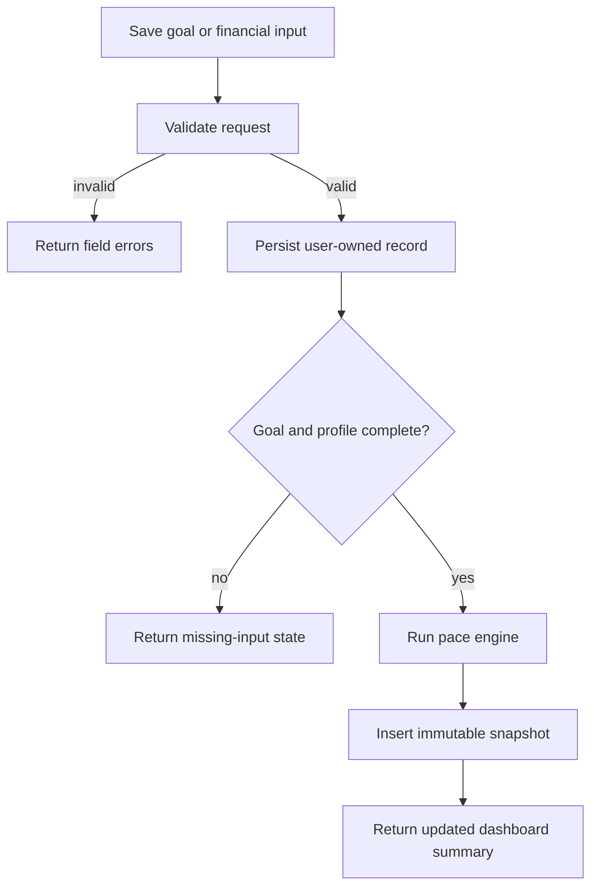

# 02 - Goal and Financial Inputs Plan

## Objective

Implement the MVP data entry surface for one active goal and manual financial assumptions. These inputs feed the deterministic pace engine and must be validated consistently on the backend.

## Data Model

- Add `Goal` with user ownership, name, target cents, initial saved cents, current saved cents, start date, target date, lifecycle status, and optional archive timestamp.
- Add `FinancialProfile` with user ownership, starting cash cents, balance-as-of date, and reserve buffer cents.
- Add `IncomeSource` with user ownership, name, amount cents, next payment date, frequency, confidence, and active flag.
- Add `PlannedExpense` with user ownership, name, amount cents, next due date, frequency, classification, and active flag.

Allowed MVP frequencies:

- `one_time`
- `weekly`
- `biweekly`
- `monthly`

Allowed income confidence values:

- `confirmed`
- `unconfirmed`

Allowed planned expense classifications:

- `essential`
- `discretionary`

## API Behavior

- `GET /api/v1/goals/active` returns the active goal or a missing-goal state.
- `POST /api/v1/goals` creates the first active goal and rejects a second active goal.
- `PATCH /api/v1/goals/{goal_id}` updates valid goal fields and preserves ownership.
- Goal lifecycle status values are `active`, `completed`, and `archived`.
- Goal lifecycle status is separate from calculated `pace_status`.
- `GET /api/v1/financial-profile` returns the current profile or a missing-profile state.
- `PUT /api/v1/financial-profile` creates or replaces the current profile.
- CRUD income sources and planned expenses through resource endpoints listed in `DESIGN.md`.
- Delete for income and expenses should soft-deactivate by setting `active = false` for MVP traceability.

## Validation Rules

- Target amount must be greater than zero.
- Current saved amount cannot be negative or greater than target amount.
- Target date must be later than the user's current local date.
- Starting cash cannot be negative for MVP.
- Balance-as-of date cannot be in the future.
- Date-only validation uses the user's configured IANA time zone.
- Money inputs are accepted as decimal dollar strings or numbers at the API boundary, then converted to integer cents before storage.
- Names and descriptions must have bounded lengths.
- Unconfirmed income remains visible but excluded from forecast resources.
- On first financial profile setup, suggest a reserve buffer equal to 5% of confirmed future income rounded up to the nearest whole U.S. dollar.
- If confirmed future income is zero, the suggested reserve buffer may be `$0`.
- Require the user to confirm or replace the suggested reserve buffer before the first valid pace calculation.
- After confirmation, reserve buffer is user-controlled and should not silently change when income changes.

## Recalculation Hook

- After any valid create, update, deactivate, or delete affecting goal or financial inputs, call the calculation service.
- If required inputs are incomplete, skip snapshot creation and return a missing-input response.
- If required inputs are complete, create a new immutable calculation snapshot.

## Tests

- Goal creation rejects invalid money, dates, and second active goal.
- Goal updates create snapshots only when required inputs exist.
- Financial profile rejects future balance-as-of dates.
- Financial profile setup suggests a 5% rounded-up reserve buffer and allows `$0` when confirmed future income is zero.
- First calculation is skipped until the reserve buffer is confirmed or replaced.
- Confirmed income is included in normalized inputs; unconfirmed income is excluded from forecast totals.
- Active expenses are included; deactivated expenses are excluded.
- Ownership tests cover goal, profile, income, and expense endpoints, and assert cross-user access returns `404`.

## Completion Criteria

- A signed-in user can create and edit all MVP inputs.
- Backend stores money only as integer cents.
- All protected records are isolated by user.
- Recalculation hook is ready for the pace engine plan.
