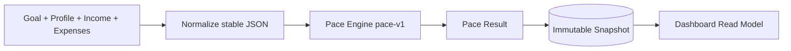

# 03 - Pace Engine and Snapshots Plan

## Objective

Implement the deterministic financial core and immutable calculation history. The pace engine must be pure, testable, and independent of FastAPI, SQLAlchemy, sessions, frontend code, and AI.

## Engine Interface

Create a `pace_engine` module exposing one main calculation function:

```python
def calculate_pace(input: PaceInput) -> PaceResult:
    ...
```

`PaceInput` should include:

- Formula version, calculation timestamp, and user time zone.
- Goal fields: target cents, initial saved cents, current saved cents, start date, target date.
- Financial profile fields: starting cash cents, balance-as-of date, reserve buffer cents.
- Confirmed and unconfirmed income source records.
- Planned expense records.
- Accepted manual transactions only if transaction support exists by the time this plan is implemented.

`PaceResult` should include all required outputs listed in `DESIGN.md` plus a compact explanation payload that names major input categories and deltas from the prior snapshot when available.

## Formula Rules

- Use integer cents for all monetary inputs and intermediate values.
- Generate date-only income and expense occurrences in the user's local calendar.
- Include only income and expense occurrences with an occurrence date greater than the user's local calculation date and less than or equal to the target date.
- Exclude same-day income and planned-expense occurrences from future forecasts because the MVP does not collect occurrence times.
- Exclude unconfirmed income from forecast resources.
- Calculate remaining weeks as at least one week using calendar days from the user's local calculation date to the target date.
- Round weekly safe-to-spend down to the nearest whole U.S. dollar after dividing discretionary capacity by remaining weeks.
- If forecast resources are below goal gap, weekly safe-to-spend is zero and projected shortfall is positive.
- Calculate expected savings to date using linear progress from goal start date and initial saved amount to target amount at target date.
- Use tolerance `max($25, 5% of target amount)` for Ahead and At Risk.
- Evaluate pace status in this order: Completed when goal gap is zero; Off Pace when forecast resources are below goal gap; Ahead when current savings exceeds expected savings by at least tolerance; At Risk when current savings trails expected savings by at least tolerance; otherwise On Track.

## Snapshot Service

- Normalize all current user inputs into a stable JSON shape.
- Include user-authored goal, income, and planned-expense names in snapshot inputs when they help explain the calculation.
- Do not copy raw transaction descriptions into immutable snapshots; use minimized transaction calculation facts only.
- Run the pace engine with an explicit calculation timestamp.
- Insert a `CalculationSnapshot` row with formula version, trigger, normalized input JSON, result JSON, and UTC timestamp.
- Never update snapshot contents after insert.
- Add a helper to compare the latest two snapshots and report changed input categories and weekly safe-to-spend delta.



## Weekly Plan MVP

- Implement a `WeeklyPlan` table as designed.
- For MVP, create the current week's plan lazily when the dashboard loads and a valid latest snapshot exists.
- Do not require a background scheduler for MVP.
- If a current week plan already exists, do not replace its opening allowance during the week.
- Use the latest snapshot's weekly safe-to-spend when creating a new week plan.

## Golden Test Scenarios

- On Track: forecast resources cover goal gap with positive safe-to-spend.
- Off Pace: forecast resources are below goal gap and projected shortfall is positive.
- Completed: current saved amount equals target amount.
- Ahead: current savings exceeds expected savings by at least tolerance.
- At Risk: current savings trails expected savings by at least tolerance while forecast still covers goal gap.
- Less Than One Week: target date fewer than seven days away uses one remaining week.
- Rounding: final weekly safe-to-spend rounds down to whole dollars.
- Unconfirmed Income: visible in inputs but excluded from forecast resources.

## Tests

- Pure unit tests for each formula component.
- Determinism test for byte-equivalent results with identical normalized inputs.
- Snapshot immutability test.
- Snapshot schema test proves raw transaction descriptions are excluded.
- API integration test proves valid input change creates a new snapshot.
- Weekly plan test proves current week opening allowance is not replaced by midweek recalculation.

## Completion Criteria

- Golden tests pass.
- Calculation results match SRS formula semantics.
- Services create immutable snapshots for valid recalculation triggers.
- Dashboard endpoint can read the latest snapshot and current weekly plan.
