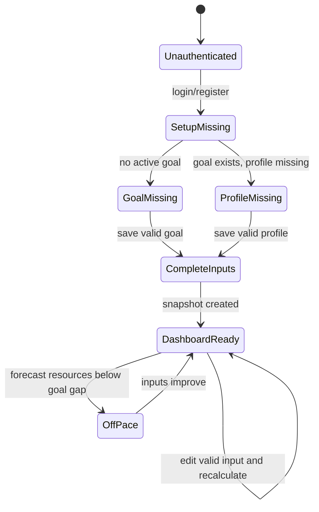

# 04 - Dashboard MVP Plan

## Objective

Build the user-facing MVP dashboard and form flow around the deterministic plan result. The dashboard should make the weekly safe-to-spend value obvious while keeping calculation assumptions inspectable.

## Main Views

- Register and sign-in pages.
- Dashboard page.
- Goal form.
- Financial profile form.
- Income source list and form.
- Planned expense list and form.

Primary navigation should expose Dashboard, Goal, Income, Expenses, and Account. Transactions, AI, and Data/Privacy navigation can be omitted or shown as disabled post-MVP items only if useful for course demos.

## Dashboard Content

When required inputs are complete:

- Goal name, target amount, current saved amount, target date, and progress percentage.
- Pace status.
- Current weekly opening allowance.
- Latest weekly safe-to-spend.
- Planned future income, planned future expenses, reserve buffer, goal gap, remaining weeks, and formula version.
- Deterministic explanation of why the value changed compared with the previous snapshot when available.

When inputs are incomplete:

- Show the missing goal or financial profile fields.
- Do not present weekly safe-to-spend as a valid recommendation.
- Provide direct actions to complete the missing setup.

## Interaction Behavior

- Saving a valid form should update the dashboard state without requiring a full browser reload.
- Field-level validation errors should identify the affected field and preserve valid entries.
- The "How was this calculated?" interaction should reveal calculation details from the latest snapshot.
- Unconfirmed income should be visibly separated from confirmed income.
- Off Pace should show projected shortfall and weekly safe-to-spend as zero.

## UI Constraints

- Responsive down to 360px mobile width and desktop widths of 1024px or greater.
- Monetary inputs show dollars with two decimals; headline safe-to-spend may show whole dollars.
- Controls must be keyboard accessible with visible focus states.
- Do not rely on color alone for pace status or progress.
- Keep the interface task-focused and dense enough for repeated use.

## Tests

- User can register, log in, complete setup, and view the dashboard result.
- Missing-input states prevent misleading safe-to-spend output.
- Editing income, expense, or goal data updates the displayed result.
- "How was this calculated?" displays the formula inputs and formula version.
- Mobile viewport smoke test confirms forms and dashboard do not overflow.
- Accessibility smoke test checks labels, focus states, and keyboard navigation for primary workflow.

## Completion Criteria

- A demo user can complete the primary workflow in under five minutes.
- Dashboard values come from backend calculation snapshots, not frontend financial logic.
- UI remains usable when no AI provider exists.

