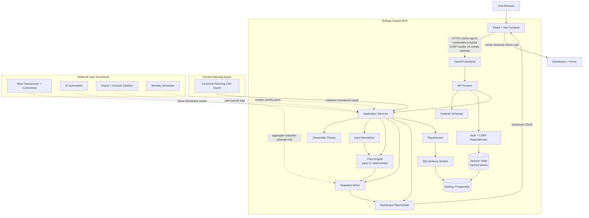
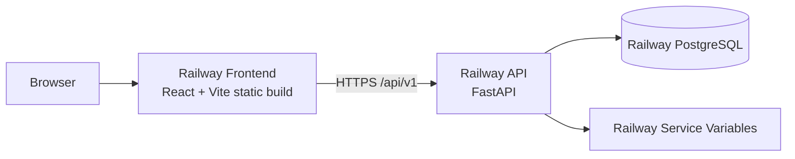

# GoalWise Architecture

GoalWise is a progressive MVP/PDR subset of the broader SRS. The current architecture proves the core planning loop: authenticate, enter or import one goal and manual financial assumptions, calculate an explainable weekly safe-to-spend result, store immutable snapshots, and render the dashboard. An accepted canonical planning CSV importer and optional explain-only AI layer sit outside the deterministic financial core.

This file holds the high-level system diagram. More focused diagrams and decision details live in:

- [Architecture decision process](docs/architecture-decision-process.md)
- [Architecture Decision Records](docs/adr/README.md)
- [Implementation Specs](docs/specs/README.md)
- [Backend design](DESIGN.md)

## High-Level System

## Boundary Rules

- The backend is the source of truth for authentication, authorization, validation, financial calculations, snapshots, dashboard metrics, and ownership checks.
- The React frontend must not duplicate pace-engine formulas or official dashboard metric formulas.
- The pace engine is deterministic and AI-free.
- Calculation snapshots are immutable and versioned.
- User-owned resource access is enforced server-side; cross-user private resource access returns `404`.
- Raw transaction import, export/delete, and background scheduling are deferred from the current MVP subset. Runtime AI is optional and explain-only; it cannot affect financial calculations or dashboard values.

## Deployment Shape

Hosted cookies use `Secure=true`. Same-site deployment uses `SameSite=Lax`; cross-site deployment uses `SameSite=None`, explicit CORS allowlists, credentials, and CSRF verification.
