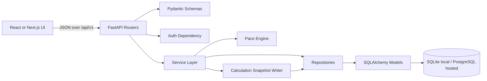
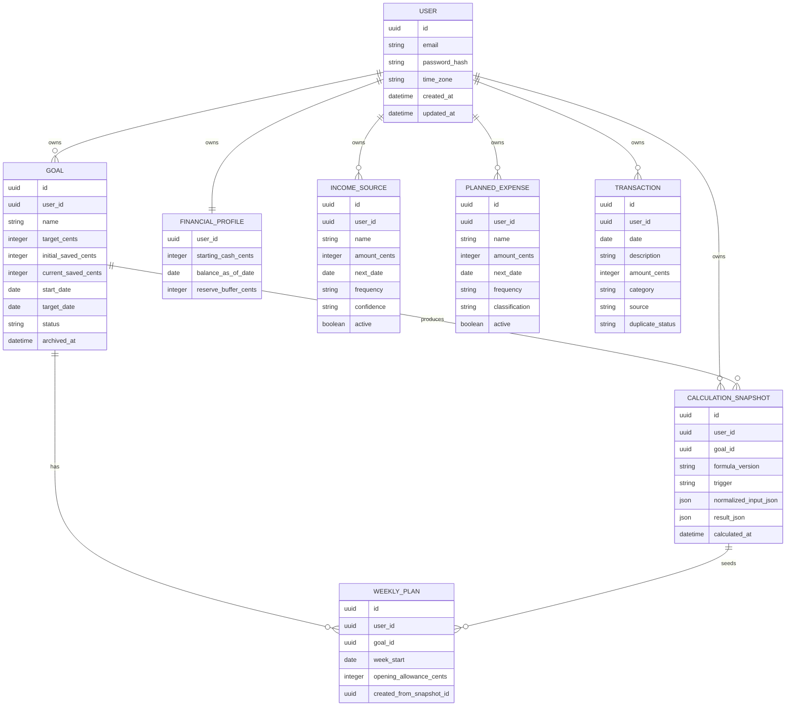
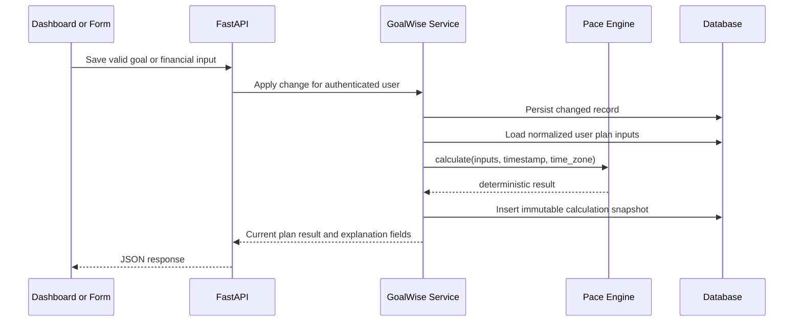

# GoalWise Backend Design

## Purpose

GoalWise is a lightweight goal-oriented budgeting MVP. The backend owns authentication, user-owned financial data, deterministic pace calculations, and immutable calculation snapshots. The MVP intentionally avoids live bank sync, AI-generated summaries, account export/delete workflows, and production-grade automation so the team can deliver the core planning loop first.

## Architecture

The backend is a FastAPI service with SQLAlchemy models and Alembic migrations. SQLite is acceptable for local development and automated tests; the schema must remain PostgreSQL-compatible for hosted deployment. The frontend communicates with a versioned JSON REST API under `/api/v1`.

### Backend Layers

- Routers parse requests, call dependencies, and return consistent JSON responses.
- Pydantic schemas validate request and response shapes at the API boundary.
- Services implement business rules such as one active goal, ownership checks, recalculation triggers, and snapshot creation.
- Repositories isolate SQLAlchemy queries and keep database access parameterized.
- `pace_engine` is a pure deterministic module with no database, HTTP, AI, or session dependencies.

## Core Data Model

All money is stored as integer cents. Date-only values represent the user's local calendar date. Timestamps are stored in UTC. Each private row belongs to one `user_id`, and every protected endpoint must enforce server-side ownership.

## Pace Engine

The pace engine receives normalized inputs and returns a structured result. It must be deterministic for identical inputs, timestamp, time zone, and formula version.

Formula version for MVP: `pace-v1`.

Required outputs:

- `current_cash_cents`
- `confirmed_future_income_cents`
- `planned_future_expenses_cents`
- `reserve_buffer_cents`
- `forecast_resources_cents`
- `goal_gap_cents`
- `discretionary_capacity_cents`
- `remaining_weeks`
- `weekly_safe_to_spend_cents`
- `projected_shortfall_cents`
- `expected_savings_to_date_cents`
- `pace_status`

Calculation rules:

- `current_cash = starting cash + accepted inflows after balance-as-of date - accepted outflows after balance-as-of date`.
- Include only confirmed income occurrences after the calculation timestamp and on or before the target date.
- Include active planned expense occurrences after the calculation timestamp and on or before the target date.
- `forecast_resources = current cash + confirmed future income - planned future expenses - reserve buffer`.
- `goal_gap = max(0, target amount - current saved amount)`.
- `discretionary_capacity = forecast resources - goal gap`.
- `remaining_weeks = max(1, ceiling(calendar days from calculation date to target date / 7))`.
- `weekly_safe_to_spend = max(0, floor(discretionary capacity / remaining weeks) rounded down to whole dollars)`.
- `projected_shortfall = max(0, goal gap - forecast resources)`.
- Pace status order: Completed, Off Pace, Ahead, At Risk, On Track.

## API Design

Use REST resources under `/api/v1`. Endpoint naming should remain resource-based and predictable.

MVP endpoints:

- `POST /api/v1/auth/register`
- `POST /api/v1/auth/login`
- `POST /api/v1/auth/logout`
- `GET /api/v1/me`
- `GET /api/v1/goals/active`
- `POST /api/v1/goals`
- `PATCH /api/v1/goals/{goal_id}`
- `GET /api/v1/financial-profile`
- `PUT /api/v1/financial-profile`
- `GET /api/v1/income-sources`
- `POST /api/v1/income-sources`
- `PATCH /api/v1/income-sources/{income_source_id}`
- `DELETE /api/v1/income-sources/{income_source_id}`
- `GET /api/v1/planned-expenses`
- `POST /api/v1/planned-expenses`
- `PATCH /api/v1/planned-expenses/{planned_expense_id}`
- `DELETE /api/v1/planned-expenses/{planned_expense_id}`
- `GET /api/v1/dashboard`
- `GET /api/v1/calculation-snapshots/latest`

Response conventions:

- Success responses return JSON objects, not bare arrays when metadata may be needed later.
- Validation failures return HTTP `422` with field-level errors.
- Unauthorized requests return `401`; authenticated users without ownership return `404` or `403` consistently by endpoint policy, with no leaked financial content.
- Unexpected errors return a generic message and log only non-sensitive metadata.

## Security and Privacy Choices

- Hash passwords with Argon2id, or bcrypt if Argon2id is unavailable in the chosen Python stack.
- Require passwords of at least 12 characters.
- Use secure, HTTP-only session cookies for browser sessions.
- Expire sessions after inactivity and revoke the current session on logout.
- Perform ownership checks in service/repository methods for every user-owned resource.
- Validate all client input server-side for type, range, length, date validity, enum values, and money bounds.
- Do not request or store bank usernames, bank passwords, card PINs, full card numbers, brokerage credentials, government identifiers, or production financial institution credentials.
- Avoid logging raw transaction descriptions, passwords, session tokens, full email addresses, exact balances, or exact goal amounts.

## MVP Deferrals

- CSV import, duplicate detection UI, and transaction correction workflows.
- AI summaries, AI validation, provider adapters, and AI safety evals.
- Account export and deletion flows.
- Background weekly snapshot scheduler; MVP may create or refresh weekly plans on authenticated dashboard access.
- Full production load testing and uptime monitoring.
- Native mobile apps, bank integrations, and multi-goal support.

