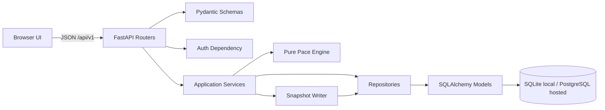

# ADR-0001: Use a Layered Modular Monolith

- **Status:** Accepted
- **Date:** 2026-08-01
- **Deciders:** Nati Seifu
- **Related requirements:** FR-AUTH-001 to FR-AUTH-005, FR-GOAL-001 to FR-GOAL-005, FR-FIN-001 to FR-FIN-007, FR-PACE-001, FR-PACE-006, FR-UI-001 to FR-UI-004, NFR-SEC-005, NFR-MNT-001, NFR-MNT-002

## Context

GoalWise needs to deliver an MVP planning loop: authenticate, enter one goal and manual financial assumptions, calculate a deterministic weekly safe-to-spend amount, persist a calculation snapshot, and show a dashboard.

The main architectural drivers are deliverability, determinism, privacy, explainability, and changeability. The system should be small enough to build quickly, but structured enough that post-MVP features such as CSV import, weekly automation, and optional AI summaries can be added without rewriting the financial core.

## Decision

We will use a layered modular monolith:

- FastAPI routers for HTTP endpoints under `/api/v1`.
- Pydantic schemas for request and response validation.
- Application services for business rules, recalculation triggers, ownership checks, and snapshot creation.
- Repositories for SQLAlchemy query isolation.
- SQLAlchemy models and Alembic migrations for persistence.
- A pure `pace_engine` module with no web, database, session, frontend, or AI dependencies.

## Alternatives considered

- **Layered modular monolith** - Chosen because it best fits MVP speed, simple deployment, local testability, and clear boundaries. It requires discipline to avoid service and repository leakage.
- **Client-heavy application** - Rejected because financial logic would be easier to tamper with, harder to test centrally, and harder to audit.
- **Microservices** - Rejected because operational complexity and distributed data consistency are unjustified for one product loop.
- **Event-driven architecture** - Rejected because asynchronous projections are unnecessary for the MVP dashboard and would slow delivery.
- **AI-agentic architecture** - Rejected because it is a poor fit for deterministic financial calculation and review defensibility.

## Consequences

**Positive:**

- The MVP can run as one backend service and one frontend.
- The pace engine can be tested with pure golden tests.
- User ownership and validation rules can be enforced centrally.
- Future adapters can be added around the core instead of inside it.

**Negative:**

- The codebase must maintain clear module boundaries manually.
- If future traffic or team ownership grows, modules may need to be extracted later.

**Neutral / follow-ups:**

- Routers must not contain financial calculation logic.
- The pace engine must not import FastAPI, SQLAlchemy, session, frontend, or AI modules.
- Service tests must cover ownership checks and recalculation behavior.
- Golden tests must cover the pace engine independently of the database.

## AI assistance & provenance

AI helped draft the architecture alternatives, Mermaid diagram, and verification checklist. The decision to use a layered modular monolith was made by the project owner after comparing the options against the SRS drivers for deliverability, determinism, privacy, explainability, and maintainability. We verified the result by tracing the layers to the MVP workflow and by requiring tests that keep routers, services, repositories, and the pure pace engine separated.
