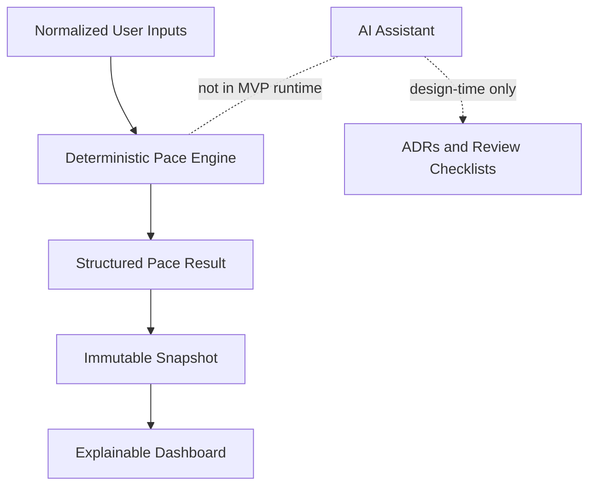

# ADR-0002: Keep the Pace Engine Deterministic and AI-Free for MVP

- **Status:** Accepted
- **Date:** 2026-08-01
- **Deciders:** Nati Seifu
- **Related requirements:** FR-PACE-001 to FR-PACE-006, FR-PACE-010, FR-AI-001 to FR-AI-007, FR-UI-001 to FR-UI-004, NFR-ACC-001, NFR-ACC-002, NFR-PRI-003, NFR-REL-003, NFR-AIQ-001 to NFR-AIQ-003

## Context

GoalWise outputs a weekly safe-to-spend amount based on user-entered savings goals, cash assumptions, income sources, planned expenses, reserve buffer, and target date. This output affects financial planning and must be explainable.

The design framework's reversibility test says AI-native reasoning is a better fit when occasional wrong outputs are reversible and low cost. GoalWise's core output is not safety-critical in the medical sense, but wrong or inconsistent financial guidance can still mislead users and weaken design-review defensibility.

## Decision

We will keep the MVP pace engine deterministic and AI-free. The engine will calculate `pace-v1` outputs from normalized inputs using explicit formula rules, integer cents, date logic, and a formula version.

AI may be used during development to draft diagrams, ADRs, tests, and review checklists. AI summaries are deferred from the MVP runtime.

## Alternatives considered

- **Deterministic formula engine** - Chosen because it is predictable, testable, explainable, and reviewable. It is less flexible than natural-language coaching.
- **Prompt-only AI summary from raw user data** - Rejected because it risks invented numbers, privacy leakage, and inconsistent advice.
- **Retrieval-augmented AI assistant** - Rejected because GoalWise's MVP problem is formulaic and does not require retrieval.
- **Fine-tuned model or autonomous agents** - Rejected because they are beyond the MVP need, costly to evaluate, and a weak fit for deterministic calculations.

## Consequences

**Positive:**

- Same inputs produce same outputs.
- Every result can be traced to formula fields.
- Golden tests can prove expected behavior.
- The system can work with no AI provider.

**Negative:**

- The MVP will not produce personalized natural-language coaching.
- Some future recommendation requirements must be rewritten as bounded deterministic rules before implementation.

**Neutral / follow-ups:**

- Add determinism tests for byte-equivalent results with identical normalized inputs.
- Add golden tests for On Track, Off Pace, Completed, Ahead, At Risk, less-than-one-week, rounding, and unconfirmed income.
- Confirm no runtime AI dependency is required for dashboard operation.

## AI assistance & provenance

AI helped draft the ADR language, identify AI-related alternatives, and create the Mermaid diagram. The decision to keep `pace-v1` deterministic was made by the project owner using the reversibility test: occasional wrong AI output is not acceptable for official financial guidance. We verified the result against the SRS by ensuring FR-AI-002 is enforced architecturally and by requiring deterministic golden tests for the pace engine.
