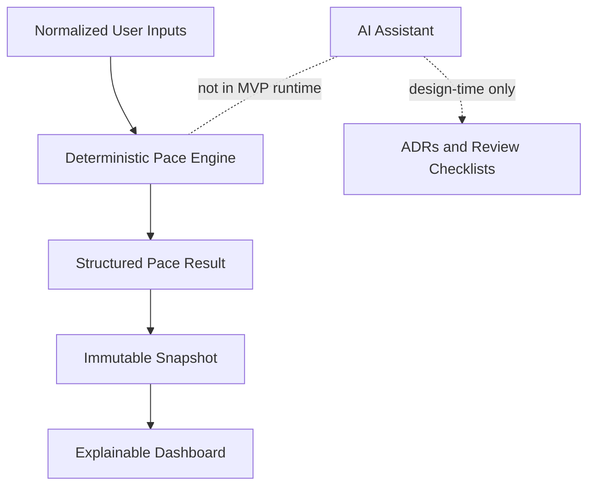

# ADR-0002: Keep the Pace Engine Deterministic and AI-Free for MVP

## Status

Accepted

## Context

GoalWise outputs a weekly safe-to-spend amount based on user-entered savings goals, cash assumptions, income sources, planned expenses, reserve buffer, and target date. This output affects financial planning and must be explainable.

The design framework's reversibility test says AI-native reasoning is a better fit when occasional wrong outputs are reversible and low cost. GoalWise's core output is not safety-critical in the medical sense, but wrong or inconsistent financial guidance can still mislead users and weaken design-review defensibility.

## Decision

Keep the MVP pace engine deterministic and AI-free. The engine will calculate `pace-v1` outputs from normalized inputs using explicit formula rules, integer cents, date logic, and a formula version.

AI may be used during development to draft diagrams, ADRs, tests, and review checklists. AI summaries are deferred from the MVP runtime.

## Options Considered

| Option | Tradeoffs |
| --- | --- |
| Deterministic formula engine | Predictable, testable, explainable, and reviewable. Less flexible than natural-language coaching. |
| Prompt-only AI summary from raw user data | Easy to prototype, but risks invented numbers, privacy leakage, and inconsistent advice. |
| Retrieval-augmented AI assistant | Useful for document-heavy advice, but GoalWise's MVP problem is formulaic and does not require retrieval. |
| Fine-tuned model or autonomous agents | Far beyond MVP need; high cost, hard evaluation, and weak fit for deterministic calculations. |

## Consequences

Positive:

- Same inputs produce same outputs.
- Every result can be traced to formula fields.
- Golden tests can prove expected behavior.
- The system can work with no AI provider.

Negative:

- The MVP will not produce personalized natural-language coaching.
- Some future recommendation requirements must be rewritten as bounded deterministic rules before implementation.

## Verification

- Add determinism tests for byte-equivalent results with identical normalized inputs.
- Add golden tests for On Track, Off Pace, Completed, Ahead, At Risk, less-than-one-week, rounding, and unconfirmed income.
- Confirm no runtime AI dependency is required for dashboard operation.

