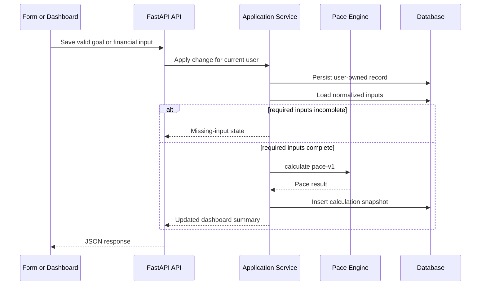

# ADR-0003: Use Immutable Calculation Snapshots

- **Status:** Accepted
- **Date:** 2026-08-01
- **Deciders:** Nati Seifu
- **Related requirements:** FR-GOAL-004, FR-FIN-007, FR-PACE-005, FR-PACE-006, FR-UI-002, FR-UI-004, FR-DATA-001, NFR-ACC-002, NFR-PRI-002, NFR-MNT-003

## Context

GoalWise users need to inspect how a weekly safe-to-spend amount was calculated. The system also needs to explain changes after edits to goals, income, expenses, or financial profile data. If calculation results are only stored as current mutable fields, the team cannot audit prior outputs or compare changes reliably.

## Decision

We will create an immutable `CalculationSnapshot` after each valid input change when required inputs are complete. Each snapshot stores:

- Authenticated `user_id`.
- Related `goal_id`.
- Formula version.
- Trigger.
- Stable normalized input JSON.
- Structured result JSON.
- UTC calculation timestamp.

Snapshots are inserted and never updated.

The exact JSON shapes are defined in [SPEC-0004: Snapshot JSON Schema](../specs/0004-snapshot-json-schema.md). Snapshot inputs include user-authored planning labels for explainability, but transaction entries use minimized calculation facts and do not copy raw transaction descriptions into immutable history.

## Alternatives considered

- **Immutable snapshots** - Chosen because they support auditability, explainability, and change comparison. They use more storage and require stable JSON normalization.
- **Store only latest result on goal/profile rows** - Rejected because it loses history and makes "why did this change?" difficult.
- **Recompute all historical values on demand** - Rejected because historical outputs can change if formulas or input normalization change.
- **Event sourcing for every input mutation** - Rejected because it adds more audit complexity than the MVP needs.

## Consequences

**Positive:**

- Dashboard details can come from the backend's recorded calculation.
- Formula changes can be introduced under a new version without rewriting old results.
- The latest two snapshots can be compared to explain changed input categories and safe-to-spend deltas.

**Negative:**

- Snapshot JSON shape must remain stable.
- Sensitive financial values must be protected in logs and access controls.
- Raw transaction descriptions are kept out of immutable snapshots, so detailed transaction insight must query the user-owned `Transaction` table.
- Storage grows with each valid input change.

**Neutral / follow-ups:**

- Snapshot immutability test proves existing snapshots are not edited.
- Snapshot schema tests prove required keys are present and raw transaction descriptions are absent.
- API integration test proves valid input changes create new snapshots.
- Dashboard endpoint reads from latest snapshot rather than recalculating in the frontend.

## AI assistance & provenance

AI helped draft the snapshot trade-offs, sequence diagram, and verification checklist. The project owner decided to use immutable snapshots to satisfy SRS requirements for explainable calculations and changed-input comparison. We verified the decision by tracing snapshot contents to FR-PACE-006 and by adding the rule that raw transaction descriptions are excluded from immutable snapshot JSON.
