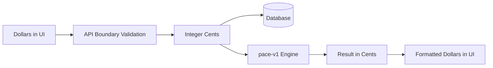

# ADR-0004: Store Money as Integer Cents and Use Formula Versioning

- **Status:** Accepted
- **Date:** 2026-08-01
- **Deciders:** Nati Seifu
- **Related requirements:** FR-PACE-001, FR-PACE-002, FR-PACE-006, NFR-ACC-001, NFR-ACC-002, NFR-MNT-003

## Context

GoalWise performs financial calculations involving cash, savings targets, income, expenses, reserve buffers, projected shortfalls, and weekly safe-to-spend values. Floating-point arithmetic can create rounding artifacts that are unacceptable in user-facing money calculations.

The MVP also needs a way to evolve formulas without making old snapshots ambiguous.

## Decision

We will store all money values as integer cents. Accept user-facing dollar input at the API boundary and convert it to cents before storage and calculation.

Use formula version `pace-v1` for MVP calculation snapshots. Any future incompatible formula change must use a new formula version.

## Alternatives considered

- **Integer cents** - Chosen because cents are predictable, portable, and easy to compare in tests. This requires careful API conversion and formatting.
- **Decimal database type and Decimal objects** - Rejected because they are accurate but more complex across JSON boundaries and frontend formatting.
- **Floating-point numbers** - Rejected because they are vulnerable to rounding artifacts and inconsistent output.
- **Store formatted money strings** - Rejected because strings make querying and calculation harder.

## Consequences

**Positive:**

- Calculation tests can compare exact integer values.
- Rounding behavior is explicit.
- Historical snapshots remain interpretable through formula versioning.

**Negative:**

- API validation must reject ambiguous or invalid money inputs.
- UI formatting must convert cents back to dollars consistently.
- Very large values need bounds validation.

**Neutral / follow-ups:**

- Tests must prove money is stored as integer cents.
- Rounding tests must confirm weekly safe-to-spend rounds down to whole U.S. dollars.
- Snapshot tests must include `formula_version`.

## AI assistance & provenance

AI helped draft the alternatives and Mermaid data-flow diagram. The project owner decided to use integer cents and formula versioning because the SRS requires exact, deterministic financial calculations. We verified the decision by tracing it to FR-PACE-002, NFR-ACC-001, and NFR-MNT-003, and by requiring tests for cent storage, conservative rounding, and formula-version presence.
