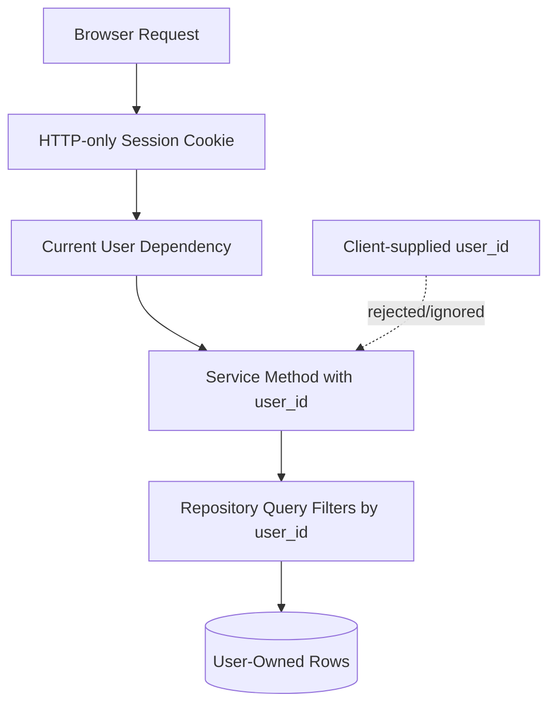

# ADR-0005: Use Server-Side Sessions and Ownership Checks

## Status

Accepted

## Context

GoalWise stores private user financial assumptions and savings goals. The MVP is browser-based and uses a JSON API. The architecture must prevent unauthenticated access and cross-user access while staying simple enough to implement quickly.

## Decision

Use secure HTTP-only session cookies for browser authentication. Store only password hashes using Argon2id, or bcrypt if Argon2id is unavailable in the chosen Python stack.

Every service method that touches private data must receive the authenticated user id explicitly. Every user-owned repository query must filter by `user_id`. Protected endpoints must not trust `user_id` from request bodies.

## Options Considered

| Option | Tradeoffs |
| --- | --- |
| Server-side sessions with HTTP-only cookies | Good browser security posture and simple logout/revocation. Requires session storage and CSRF-aware cookie settings. |
| JWT access tokens in browser storage | Common for APIs, but logout/revocation is harder and browser storage increases token exposure risk. |
| Stateless signed cookies | Simple infrastructure, but revocation and session invalidation are harder. |
| No auth for MVP demo | Faster prototype, but violates privacy and core requirements. |

## Consequences

Positive:

- Session revocation on logout is straightforward.
- Client JavaScript cannot read HTTP-only cookies.
- Ownership rules are centralized in backend services and repositories.

Negative:

- Cookie security settings must be configured correctly per environment.
- Session storage must be created and tested.
- Rate limiting is deferred unless the selected stack provides simple local middleware.

## Verification

- Auth tests cover register, login, logout, invalid credentials, and protected endpoint rejection.
- Cross-user access tests prove users cannot fetch or mutate another user's records by changing identifiers.
- Logs must exclude passwords, session tokens, full email addresses, and exact financial values.

