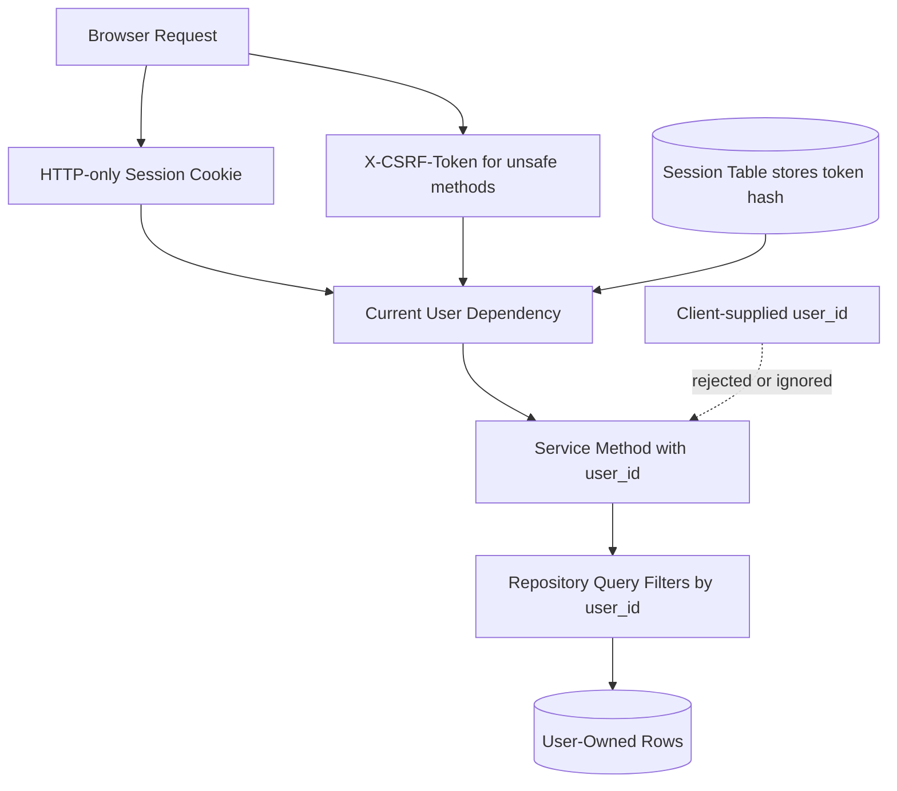

# ADR-0005: Use Server-Side Sessions and Ownership Checks

## Status

Accepted

## Context

GoalWise stores private user financial assumptions and savings goals. The MVP is browser-based and uses a JSON API. The architecture must prevent unauthenticated access and cross-user access while staying simple enough to implement quickly.

## Decision

Use Argon2id for password hashing. Use database-backed server-side sessions for browser authentication. The browser stores only an opaque session token in a secure HTTP-only cookie; the database stores only a hash of that token.

Require CSRF protection for authenticated state-changing requests. The backend issues a per-session CSRF token on login and `/api/v1/me`; the React frontend sends it in an `X-CSRF-Token` header for `POST`, `PUT`, `PATCH`, and `DELETE` requests.

Session and cookie details are specified in [SPEC-0001: Auth and Session Security](../specs/0001-auth-session-security.md).

Every service method that touches private data must receive the authenticated user id explicitly. Every user-owned repository query must filter by `user_id`. Protected endpoints must not trust `user_id` from request bodies.

For MVP user-owned resources, return `404 Not Found` when the resource either does not exist or does not belong to the authenticated user. This avoids confirming whether another user's private financial resource exists. Use `401 Unauthorized` for unauthenticated requests. Reserve `403 Forbidden` for future role-based or account-state authorization failures.

## Options Considered

| Option | Tradeoffs |
| --- | --- |
| Database-backed sessions with HTTP-only cookies | Best MVP fit. Good browser security posture, simple logout/revocation, inspectable sessions, and works with SQLite locally and PostgreSQL hosted. Requires one lookup per authenticated request and CSRF checks. |
| Redis-backed sessions | Fast expiration and good production scaling, but adds infrastructure that the MVP does not otherwise need. |
| JWT access tokens in browser storage | Common for APIs, but logout/revocation is harder and browser storage increases token exposure risk. |
| Stateless signed cookies | Simple infrastructure, but revocation and session invalidation are harder. |
| No auth for MVP demo | Faster prototype, but violates privacy and core requirements. |

## Consequences

Positive:

- Session revocation on logout is straightforward.
- Client JavaScript cannot read HTTP-only cookies.
- CSRF protection covers state-changing cookie-authenticated requests.
- Ownership rules are centralized in backend services and repositories.
- Cross-user resource existence is not revealed through response codes.

Negative:

- Cookie security settings must be configured correctly per environment.
- Session storage must be created and tested.
- Each authenticated request requires session lookup and expiration checks.
- Login rate limiting must be implemented for the MVP after 5 failed attempts within 10 minutes by account and source.

## Verification

- Auth tests cover register, login, logout, invalid credentials, and protected endpoint rejection.
- CSRF tests cover missing, invalid, and valid tokens for state-changing authenticated requests.
- Session tests prove the database stores token hashes rather than raw tokens.
- Cross-user access tests prove users cannot fetch or mutate another user's records by changing identifiers.
- Cross-user access tests must assert `404`, not `403`.
- Logs must exclude passwords, session tokens, full email addresses, and exact financial values.
