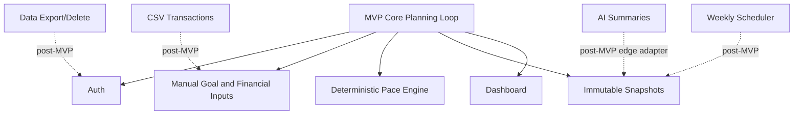

# ADR-0007: Defer Bank Sync, CSV Import, and AI Summaries from MVP

## Status

Accepted

## Context

The full product vision includes transaction imports, account export/delete, weekly automation, recommendations, production hardening, and optional AI summaries. Building these before the core planning loop would increase scope and security risk.

The MVP must prove that a user can manually enter assumptions and receive an explainable deterministic plan.

## Decision

Defer these from the MVP:

- Live bank sync and bank credential handling.
- CSV import, duplicate detection, transaction correction UI, and row-level import reports.
- AI summaries, AI validation, AI provider adapters, and AI safety evals.
- Account export and deletion workflows.
- Background weekly snapshot scheduler.
- Multi-goal support, native mobile apps, transfers, payments, credit, tax, investment, or advisory features.

Keep extension points in the architecture by isolating the deterministic core behind services and normalized inputs.

## Options Considered

| Option | Tradeoffs |
| --- | --- |
| Defer complex integrations | Keeps MVP buildable and reduces security risk. Requires clear roadmap documentation. |
| Include CSV import in MVP | More realistic data entry, but adds parsing, duplicate detection, correction UI, and partial failure handling. |
| Include AI summaries in MVP | More impressive demo, but introduces safety, consistency, privacy, and evaluation work before the deterministic core is proven. |
| Include bank sync in MVP | Strong automation value, but credential and provider risk are far beyond course MVP scope. |

## Consequences

Positive:

- The first implementation can focus on the core user value.
- The architecture avoids premature agentic or integration complexity.
- Security review scope is smaller.

Negative:

- Manual data entry limits realism.
- Some SRS requirements remain roadmap items.
- Reviewers may ask how deferred features fit later, so the roadmap must stay explicit.

## Verification

- MVP navigation must not imply unsupported bank sync, AI, export/delete, or transaction correction flows are available.
- README or docs must preserve deferred requirements and roadmap order.
- Future features must integrate through services and normalized inputs rather than changing the pace engine into a provider-specific module.

