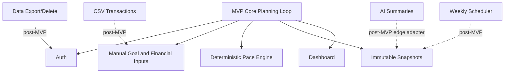

# ADR-0007: Defer Bank Sync, CSV Import, and AI Summaries from MVP

## Status

Accepted

## Context

The SRS defines the broader GoalWise v1.0 product vision, including transaction imports, account export/delete, weekly automation, recommendations, production hardening, and optional AI summaries. This architecture package is a progressive course MVP/PDR subset of that SRS, not the complete v1.0 implementation.

The MVP must prove that a user can manually enter assumptions and receive an explainable deterministic plan.

## Decision

Defer these SRS capabilities from the current MVP increment:

- Live bank sync and bank credential handling.
- CSV import, duplicate detection, transaction correction UI, and row-level import reports.
- AI summaries, AI validation, AI provider adapters, and AI safety evals.
- Account export and deletion workflows.
- Background weekly snapshot scheduler.
- Multi-goal support, native mobile apps, transfers, payments, credit, tax, investment, or advisory features.

Keep extension points in the architecture by isolating the deterministic core behind services and normalized inputs.

Detailed SRS mapping is captured in [SPEC-0007: SRS Traceability and MVP Scope](../specs/0007-srs-traceability-and-mvp-scope.md).

## Options Considered

| Option | Tradeoffs |
| --- | --- |
| Progressive MVP subset of the SRS | Keeps MVP buildable while preserving the SRS as the broader source of truth. Requires explicit traceability so deferrals are not mistaken for forgotten requirements. |
| Implement the full SRS immediately | Most complete, but much larger than the current course MVP/PDR increment. Adds CSV import, correction flows, export/delete, AI evals, scheduler operations, and more security surface. |
| Edit the SRS down to match MVP | Removes mismatch, but loses the approved broader requirements and roadmap context. |
| Defer complex integrations without traceability | Fastest documentation path, but weak for review because Must/Should requirements appear contradictory. |

## Consequences

Positive:

- The first implementation can focus on the core user value.
- The architecture avoids premature agentic or integration complexity.
- Security review scope is smaller.

Negative:

- Manual data entry limits realism.
- Some SRS requirements remain roadmap items.
- Reviewers may ask how deferred features fit later, so the roadmap must stay explicit.

## Verification

- MVP navigation must not imply unsupported bank sync, AI, export/delete, or transaction correction flows are available.
- `SPEC-0007` must identify requirements as Implement Now, Partial, Deferred, or Design Constraint.
- README or docs must preserve deferred requirements and roadmap order.
- Future features must integrate through services and normalized inputs rather than changing the pace engine into a provider-specific module.
