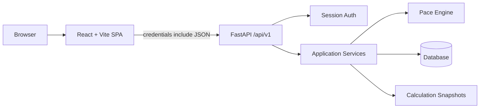

# ADR-0008: Use React and Vite for the MVP Frontend

- **Status:** Accepted
- **Date:** 2026-08-01
- **Deciders:** Nati Seifu
- **Related requirements:** FR-AUTH-002, FR-AUTH-003, FR-GOAL-001 to FR-GOAL-005, FR-FIN-001 to FR-FIN-007, FR-UI-001 to FR-UI-005, NFR-PERF-002, NFR-USA-001, NFR-USA-002, NFR-A11Y-001, NFR-A11Y-002

## Context

GoalWise needs a browser UI for registration, login, dashboard, goal setup, financial profile, income sources, and planned expenses. The frontend must call the FastAPI backend over `/api/v1` and display calculation results from backend snapshots.

The frontend is an authenticated application, not a public content site. Search engine optimization and server-rendered public pages are not architectural drivers for the MVP.

## Decision

We will use React with Vite for the MVP frontend.

The frontend is responsible for:

- Client-side routing.
- UI state and form state.
- Calling the FastAPI API with credentials included.
- Displaying backend validation errors.
- Formatting values returned by the backend for the user interface.
- Visualizing backend-provided values, such as progress bar width from a backend-provided progress percentage.

The backend remains responsible for:

- Authentication and authorization.
- Input validation at the trust boundary.
- User ownership checks.
- Financial calculations.
- Calculation snapshots.
- Dashboard source data.
- Official progress percentage.
- Goal feasibility.
- Pace status.
- Shortfall.
- Remaining weeks.
- Current-week remainder.

React must not calculate financial outputs, pace status, goal feasibility, projected shortfall, weekly safe-to-spend, remaining weeks, expected savings to date, current-week remainder, or official progress percentage.

React may compute display-only transformations:

- cents to formatted dollars;
- ISO date strings to localized display dates;
- status enum to label, color, or icon;
- backend-provided percentage to progress bar width;
- sorting or filtering already-returned lists for UI convenience;
- form dirty state and unsaved field validation hints.

## Alternatives considered

- **React + Vite** - Chosen because it has a small framework surface, fast local development, and fits authenticated forms and dashboard views. It requires defining routing, API client, and protected-route patterns.
- **Next.js** - Rejected because it adds a second server-side framework even though FastAPI already owns backend behavior. SSR and SEO are not MVP drivers.
- **Server-rendered FastAPI templates** - Rejected because they are a weaker fit for interactive dashboard/forms and less aligned with the planned React UI.
- **Native mobile first** - Rejected because native apps are outside the MVP scope.

## Consequences

**Positive:**

- The frontend stack stays lightweight.
- FastAPI remains the single backend authority.
- Private dashboard pages do not need server-side rendering.
- The MVP can be deployed as a static frontend plus API backend.

**Negative:**

- The team must define frontend conventions for routing, auth guards, form handling, and API calls.
- Public marketing pages would need a separate approach if SEO becomes important later.

**Neutral / follow-ups:**

- Frontend dashboard values must come from backend API responses, not duplicated financial logic.
- Frontend code must not duplicate pace-engine formulas or official dashboard metric formulas.
- API calls that need auth must send cookies with `credentials: "include"`.
- Protected frontend routes must redirect unauthenticated users to sign in.
- Mobile and desktop smoke tests must cover the primary form/dashboard workflow.

## AI assistance & provenance

AI helped compare React, Next.js, server-rendered templates, and native mobile options. The project owner chose React + Vite after deciding SSR was not needed for an authenticated MVP dashboard and that the backend should remain the authority for financial calculations. We verified the decision by defining the frontend/backend calculation boundary and by tracing UI responsibilities to the SRS dashboard and usability requirements.
