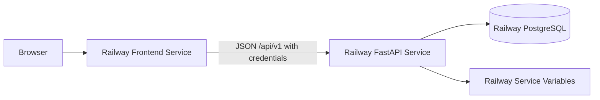

# ADR-0009: Deploy the Course MVP on Railway

## Status

Accepted

## Context

GoalWise needs a hosted course/demo deployment for a React + Vite frontend, FastAPI backend, and PostgreSQL database. The deployment target must support environment variables, public service domains, managed PostgreSQL, and a straightforward path for static frontend hosting.

Deployment affects cookie settings, CORS, CSRF, migrations, and whether the frontend/backend can be treated as same-site.

## Decision

Use Railway for the course MVP deployment.

Deployment shape:

- React + Vite frontend deployed as a Railway static site or static frontend service.
- FastAPI backend deployed as a Railway web service.
- PostgreSQL provisioned through Railway PostgreSQL.
- Runtime configuration supplied through Railway service variables.
- Railway-provided domains are acceptable for course demo; custom same-site subdomains are preferred if available.

## Options Considered

| Option | Tradeoffs |
| --- | --- |
| Railway | Good prototype ergonomics, managed PostgreSQL, service variables, public domains, static hosting support, and simple GitHub-driven deployment. Pricing/usage should be monitored. |
| Render | Simple static site, web service, and PostgreSQL story, but the team prefers Railway's workflow. |
| Fly.io | Flexible and production-like, but requires more Docker/ops comfort than the MVP needs. |
| Vercel frontend plus separate backend host | Excellent frontend hosting, but cross-site API cookies and CORS become more complex. |
| Local/demo only | Lowest setup cost, but not enough for a reachable course demo deployment. |

## Consequences

Positive:

- One platform can host frontend, backend, and database.
- Railway service variables can hold database URL, session secret, cookie settings, and allowed frontend origin.
- Railway PostgreSQL aligns with the hosted PostgreSQL requirement.
- Railway public domains allow quick demo deployment.

Negative:

- If frontend and backend use unrelated Railway-provided domains, cookie behavior may require cross-site settings.
- Usage limits and billing must be monitored.
- Same-site cookie simplicity may require custom domains.

## Verification

- Frontend deploys and can reach the backend over the configured public API origin.
- Backend reads `DATABASE_URL` and connects to Railway PostgreSQL.
- Alembic migrations run against Railway PostgreSQL before demo use.
- Hosted cookies use `Secure=true`.
- Same-site deployments use `SameSite=Lax`; cross-site deployments use `SameSite=None`, `Secure=true`, explicit CORS allowlist, credentials, and CSRF verification.
- Health check endpoint verifies API availability for the demo window.

