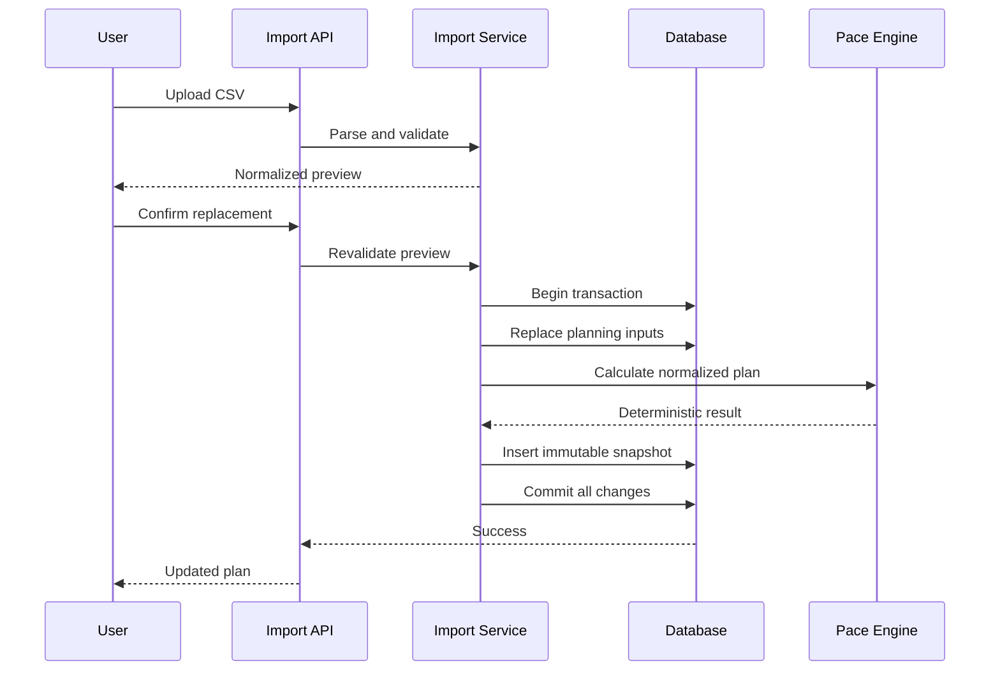

# ADR-0011: Preview and Atomically Replace the Complete Planning Setup

- **Status:** Accepted
- **Date:** 2026-08-27
- **Deciders:** Nati Seifu
- **Related requirements:** FR-ERR-001, FR-ERR-002, FR-SNAP-001 to FR-SNAP-004, NFR-REL-001, NFR-SEC-005, NFR-SEC-006, NFR-REL-001

## Context

An imported planning file can contain a goal, cash position, income sources,
and planned expenses that together describe one coherent plan. Persisting
those rows independently would expose users to partial imports: a goal could
be saved while one invalid expense remains, or old recurring inputs could
remain active beside the imported ones.

The importer also handles financial data. Users need to see what will change
before it changes, and a failure must not leave a mixed old/new planning
state. Existing GoalWise behavior already treats a valid input change and its
calculation snapshot as one transaction and requires immutable snapshots.

The first increment does not need merge conflict resolution. Supporting merge
would require policies for matching rows, duplicates, stale records, deletes,
and conflicts between the file and the current setup.

## Decision

We will require a preview followed by explicit confirmation, then atomically
replace the authenticated user's complete planning setup with the validated
canonical import.

The replacement operation will:

1. authenticate and verify CSRF protection;
2. bind confirmation to a valid preview for the same user;
3. revalidate the normalized import before persistence;
4. replace the active goal, financial profile, income sources, and planned
   expenses within one database transaction;
5. calculate the resulting plan through the existing deterministic service;
6. commit the input changes and new immutable snapshot together;
7. roll back the entire operation if any validation, persistence, or
   calculation step fails.

The prior setup remains unchanged until the transaction commits. The import
does not mutate prior snapshots and does not store the original CSV as part of
the snapshot.

The exact behavior is defined by [SPEC-0010](../specs/0010-planning-csv-import.md)
and the implementation sequence is tracked in
`.agents/implementation/phase-12-planning-csv-import.md`.

## Alternatives considered

- **Merge imported rows into the current setup** - Rejected for the first
  increment because it requires row identity, duplicate handling, conflict
  resolution, and explicit deletion semantics before the basic importer can
  be trusted.
- **Reject imports when an active setup already exists** - Rejected because it
  prevents correcting or replacing a setup and makes repeated imports
  impractical during normal use.
- **Persist each row independently** - Rejected because a failed import could
  leave a partial plan and produce misleading calculations.
- **Persist first and calculate later** - Rejected because the user could see
  an imported setup without the corresponding official calculation snapshot.
- **Preview only, with no confirmation step** - Rejected because selecting a
  file is not the same as approving replacement of a user's financial plan.

## Consequences

**Positive:**

- Users can inspect normalized values before replacement.
- Failed imports preserve the last known-good setup and snapshot.
- The resulting setup has one clear source and cannot retain stale active rows.
- Existing ownership, calculation, and snapshot rules remain centralized.
- The behavior is straightforward to test with transaction rollback tests.

**Negative:**

- An import replaces the complete setup instead of adding individual rows.
- Users must re-import or manually recreate values when they want to combine
  two files.
- Confirmation state must be bounded and protected against replay or use by a
  different authenticated user.

**Neutral / follow-ups:**

- Merge mode may be reconsidered after real usage identifies a concrete need
  and supplies a duplicate/conflict policy.
- Replacement should be presented in plain language and should identify the
  affected planning categories, not database implementation details.
- Retaining a prior setup as an undoable version is a separate product and
  data-retention decision; this ADR does not add it.

## AI assistance & provenance

AI helped enumerate persistence and rollback alternatives and identify the
failure modes of partial imports. The project owner selected preview plus
complete-plan replacement for the first increment. We verified the decision
against the existing save-and-snapshot transaction behavior, SPEC-0004's
immutability rules, SPEC-0007's reliability mapping, and the SRS requirement
that failed changes preserve the previously valid state. No runtime AI is
required for this decision.
