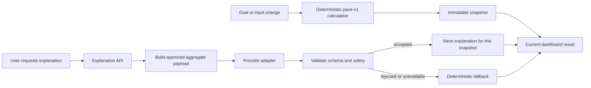

# ADR-0012: Add a Bounded AI Explanation Layer at the Edge

- **Status:** Accepted
- **Date:** 2026-08-29
- **Deciders:** Nati Seifu
- **Related requirements:** FR-AI-002 to FR-AI-007, NFR-PRI-003, NFR-REL-003, NFR-AIQ-001 to NFR-AIQ-003

## Context

GoalWise now has a deterministic calculation path and immutable snapshots. A
future AI feature may make those results easier to understand, but it must not
become part of the financial calculation boundary. A changed goal, date, or
planned input creates a new deterministic snapshot; an explanation for the
previous snapshot must never be presented as an explanation of the new one.

The feature must control provider cost, protect financial privacy, handle
untrusted output, and keep the core application usable when a provider fails.

## Decision

We will add an optional, server-configured AI explanation layer that accepts
only a committed calculation snapshot's approved aggregate fields. The
default trigger mode is an explicit user request. The first implementation is
synchronous and has a four-second provider timeout.

The AI provider will return a versioned JSON response. GoalWise will validate
the response, reject unsafe or inconsistent output, and present the accepted
content as generated explanation. The AI response will never calculate,
modify, or override safe-to-spend, pace status, projected shortfall, stored
inputs, or snapshots.

Validated explanations will be stored against the exact snapshot they explain,
with provider/model, prompt, and response-schema versions. A new snapshot has
no current explanation until one is explicitly generated for it. Provider
failure, timeout, disabled configuration, invalid output, or unsafe output
uses the existing deterministic explanation instead.

The provider boundary will be isolated behind an application adapter so the
domain and API do not depend on one vendor SDK.

## Alternatives considered

- **AI calculates or recommends the financial result** - Rejected because the
  result must remain deterministic, auditable, and backend-owned.
- **Automatic provider call after every new snapshot** - Rejected as the
  default because it creates surprise cost and latency on ordinary saves.
- **Temporary response with no persistence** - Rejected for the first version
  because revisiting a snapshot would repeat provider calls and lose the
  relationship between an explanation and the calculation it describes.
- **Direct provider calls from routes or frontend code** - Rejected because it
  leaks provider concerns across the application and makes privacy and testing
  harder.
- **Transaction classification in the same increment** - Rejected because it
  requires separate transaction semantics, confidence handling, correction
  behavior, and evaluation criteria.

## Consequences

- **Positive:** deterministic financial behavior remains independent of AI;
  explanations are tied to immutable evidence; explicit requests control cost;
  provider replacement and failure testing remain practical.
- **Negative:** the feature adds provider configuration, response validation,
  retained generated text, and a new persisted explanation concept.
- **Neutral / follow-ups:** automatic triggering may be enabled by server
  configuration after evaluation. Export and account deletion must include
  retained explanations when those workflows are implemented.

## AI assistance & provenance

AI helped enumerate trigger, persistence, provider-boundary, and failure-mode
alternatives. The project owner selected explicit request mode by default,
four-second synchronous generation, snapshot-scoped persistence, and summary
only. The decision is verified against ADR-0002, ADR-0007, the SRS AI Future
requirements, and SPEC-0011.
