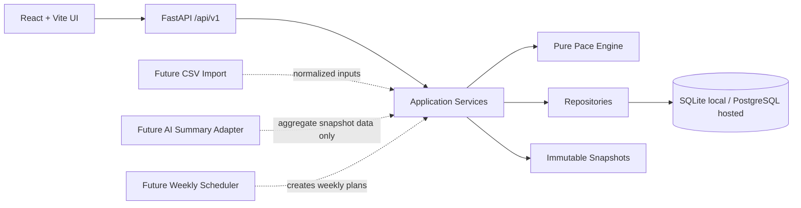

# GoalWise Architecture Decision Process

This document applies the five-phase AI-assisted system design framework to GoalWise. It records how the team frames the problem, explores alternatives, chooses the structure, hardens the model, and prepares to defend the design.

## 1. Frame the Problem

GoalWise is a lightweight goal-oriented budgeting MVP. The system must let a user sign in, enter one savings goal and manual financial assumptions, receive a deterministic weekly safe-to-spend amount, and inspect how that amount was calculated.

Architecturally significant drivers:

- Determinism: identical financial inputs, timestamp, time zone, and formula version must produce the same result.
- Privacy and ownership: every private row belongs to one user and protected endpoints must enforce server-side ownership.
- Explainability: users and reviewers must be able to inspect the formula inputs, result fields, and calculation history.
- Changeability: the MVP should support later CSV transactions, account export/delete, weekly automation, and optional AI summaries without rewriting the core.
- Deliverability: the design must be small enough for an MVP and course review timeline.

Constraints:

- No live bank sync or storage of bank credentials in the MVP.
- No AI-generated runtime financial recommendations in the MVP.
- SQLite is acceptable for local development and tests, but schema choices must remain PostgreSQL-compatible.
- Money is stored as integer cents.
- The frontend communicates with a versioned JSON REST API under `/api/v1`.

Top risks:

- Incorrect financial calculation or rounding behavior.
- Cross-user data exposure.
- Misleading dashboard output when required inputs are incomplete.
- Loss of calculation history after input changes.
- Overbuilding post-MVP features before the core planning loop works.

AI fit using the reversibility test:

- Runtime AI is not appropriate for the MVP financial core because incorrect money guidance can be misleading and hard to explain.
- AI can help during design and documentation by generating alternatives, tradeoffs, diagram drafts, checklists, and ADR drafts.
- Optional post-MVP AI summaries may be considered only at the edges, using minimized aggregate data, schema validation, deterministic fallback, and evaluation criteria.

Gate result: the top drivers are determinism, privacy, explainability, changeability, and deliverability. The MVP should not use AI at runtime.

## 2. Explore Options

The team considered these candidate structures:

| Option | Summary | Strengths | Weaknesses |
| --- | --- | --- | --- |
| Layered modular monolith | One FastAPI backend with routers, schemas, services, repositories, ORM models, and a pure pace engine | Simple deployment, strong testability, clear ownership boundaries, easy MVP delivery | Requires discipline to keep layers separated |
| Client-heavy app | Frontend performs most budgeting logic and calls a thin API for persistence | Fast UI iteration, fewer backend service methods | Duplicates financial logic, weaker auditability, greater tampering risk |
| Microservices | Separate auth, budgeting, transaction, calculation, and AI services | Independent scaling and ownership | Too much operational overhead for MVP, distributed consistency issues |
| Event-driven architecture | Input changes emit events consumed by calculation and dashboard projections | Good audit trail and future automation | More moving parts than needed for synchronous MVP feedback |
| AI-agentic orchestration | Specialized agents interpret goals, produce plans, and summarize progress | Flexible for ambiguous tasks | Poor fit for deterministic financial calculations, harder to verify and defend |

Gate result: there are multiple real alternatives. The selected structure is a layered modular monolith with a deterministic calculation core.

## 3. Decide the Structure

The major decisions are captured in Architecture Decision Records:

- [ADR-0001: Use a Layered Modular Monolith](adr/0001-layered-modular-monolith.md)
- [ADR-0002: Keep the Pace Engine Deterministic and AI-Free for MVP](adr/0002-deterministic-pace-engine-no-runtime-ai.md)
- [ADR-0003: Use Immutable Calculation Snapshots](adr/0003-immutable-calculation-snapshots.md)
- [ADR-0004: Store Money as Integer Cents and Use Formula Versioning](adr/0004-money-integer-cents-and-formula-versioning.md)
- [ADR-0005: Use Server-Side Sessions and Ownership Checks](adr/0005-auth-sessions-and-ownership.md)
- [ADR-0006: Expose a Versioned REST API for the MVP](adr/0006-versioned-rest-api.md)
- [ADR-0007: Defer Bank Sync, CSV Import, and AI Summaries from MVP](adr/0007-mvp-deferrals.md)
- [ADR-0008: Use React and Vite for the MVP Frontend](adr/0008-react-vite-frontend.md)
- [ADR-0009: Deploy the Course MVP on Railway](adr/0009-railway-deployment.md)

ADRs and specs have different jobs:

- ADRs answer why the team chose a direction.
- Specs answer exactly how the chosen behavior or contract must work.

Use ADRs for significant architectural choices, alternatives, tradeoffs, and consequences. Use specs for implementation-ready contracts such as pace-engine behavior, snapshot JSON shape, API response conventions, auth/session rules, date/time semantics, and SRS traceability.

Specs live in [docs/specs](specs/README.md) and are serially tracked like ADRs:

```text
docs/
  adr/
    0001-layered-modular-monolith.md
  specs/
    0001-pace-engine-behavior.md
    0002-snapshot-json-schema.md
    0003-auth-session-security.md
```

ADR numbers never change once created. Spec numbers also never change once created, but specs are expected to evolve more often. A spec may move from `Draft` to `Accepted` to `Superseded`. If a spec changes materially but still describes the same contract, update it in place. If it replaces the contract, create a new spec and mark the old one `Superseded`.

Gate result: each major decision is tied to at least one architectural driver.

## 4. Model and Harden

The selected model keeps change-prone concerns isolated:



Security hardening points:

- Authenticate with secure HTTP-only session cookies.
- Filter every user-owned query by authenticated `user_id`.
- Validate all client input at the API boundary.
- Never trust `user_id` from request bodies.
- Avoid logging passwords, session tokens, raw transaction descriptions, exact balances, or exact goal amounts.
- Keep AI, banking credentials, account export/delete, and scheduler automation out of MVP scope until controls are designed.

Threats and mitigations:

| Threat | Mitigation |
| --- | --- |
| User changes an id to access another user's data | Service/repository ownership checks and cross-user tests |
| Dashboard shows a recommendation before setup is complete | Missing-input states and no valid safe-to-spend value until required inputs exist |
| Calculation changes cannot be audited | Immutable snapshots with formula version and normalized input JSON |
| Money rounding produces inconsistent output | Integer cents and golden tests for rounding |
| AI summary invents advice or numbers post-MVP | Minimized aggregate input, JSON schema validation, deterministic fallback, eval set |

Gate result: models trace back to requirements and hardening points.

## 5. Review and Defend

PDR/CDR review checklist:

- Can each endpoint be traced to an MVP requirement or documented deferral?
- Can every major decision be defended using determinism, privacy, explainability, changeability, or deliverability?
- Do all Mermaid diagrams match the ADRs and `DESIGN.md`?
- Does the design prevent cross-user access?
- Does the dashboard avoid showing misleading safe-to-spend output when inputs are missing?
- Does the pace engine avoid database, HTTP, session, frontend, and AI dependencies?
- Are post-MVP features isolated rather than partially built into the MVP core?

Gate result: a teammate or AI coding agent should be able to implement from `DESIGN.md`, these ADRs, and the plan files without asking what the architecture meant.
