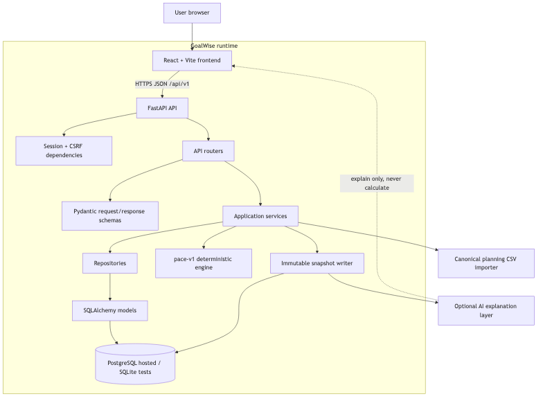
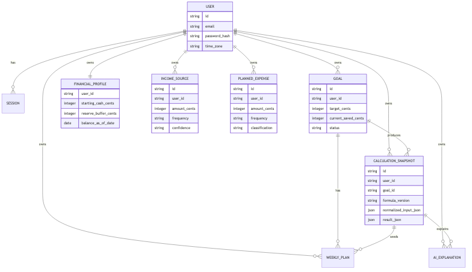
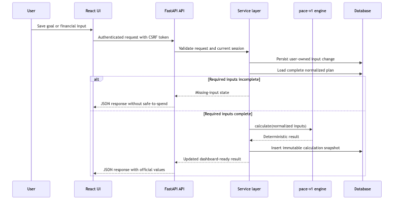

# GoalWise final project report

Course: MSCS 2101 Software Engineering  
Project: GoalWise  
Team: Group 3, Nati, Vishal, Ashutosh, Thanh  
Report status: Draft for team review  
Primary baseline: SRS v2.0 plus accepted post-CDR increments  
Repository: `github.com/NatiSeifu/goal-wise`

## 1. Executive summary

GoalWise is a goal-oriented budgeting web application that helps a user answer one practical question: "Am I on pace to reach this savings goal, and how much can I safely spend this week?" The system is designed around one active near-term savings goal, user-entered planning assumptions, and a deterministic backend calculation called `pace-v1`. Instead of trying to become a full personal finance platform, the project focuses on a narrower planning loop that a user can understand, revise, and audit.

The project reached an integrated implementation state with a React and Vite frontend, a FastAPI backend, SQLAlchemy and Alembic persistence, PostgreSQL deployment readiness, a deterministic pace engine, immutable calculation snapshots, a canonical planning CSV importer, and a bounded optional AI explanation layer. The implemented system supports registration, login, session and CSRF protection, goal setup, financial profile input, income sources, planned expenses, dashboard calculation results, calculation history, planning import preview and confirmation, and AI explanations that describe committed snapshot results. The work is still a course MVP rather than a complete commercial product. Raw transaction import, bank sync, multi-goal support, account export and deletion, background scheduling, full monitoring, and production-grade load testing remain future work unless the team explicitly re-scopes them.

The three most consequential engineering decisions were:

1. GoalWise keeps the financial core deterministic and AI-free. The safe-to-spend amount, pace status, projected shortfall, and dashboard metrics come from backend code and versioned formulas, not from a language model.
2. GoalWise uses a layered modular monolith. FastAPI routers, Pydantic schemas, services, repositories, SQLAlchemy models, Alembic migrations, and the pure `pace_engine` module are separated without introducing microservice complexity.
3. GoalWise stores immutable calculation snapshots. Each valid input change can produce a versioned record of normalized inputs and results, which supports explainability, testing, auditing, and future AI summaries without making AI authoritative.

The project succeeded at building and demonstrating the core planning workflow. It also produced design artifacts, ADRs, source-traceable requirements, automated tests, CI gates, security review evidence, and deployment-readiness work. The remaining risk is not that the architecture is unclear. The main remaining risk is completing final hardening: stronger release evidence, final accessibility review, complete data-rights workflows, production monitoring, dependency posture cleanup, and a final pass to reconcile every SRS requirement against what is actually shipped.

## 2. Problem, stakeholders, and scope

### 2.1 Problem

Traditional budgeting tools often begin with categories, accounts, transaction history, and broad monthly reports. That can be useful, but it does not directly answer the question a user has when pursuing a near-term savings goal: "Given my current cash, my future income, my planned expenses, my reserve buffer, and the target date, what is safe to spend this week?"

GoalWise addresses that narrower problem. The product turns a savings target and planning assumptions into a weekly safe-to-spend number, a pace status, a projected shortfall, and a calculation explanation. The value is not automation for its own sake. The value is a result the user can trace and adjust.

### 2.2 Stakeholders

| Stakeholder | Need |
| --- | --- |
| Registered user | Create a private savings plan, understand whether the plan is on pace, and revise inputs when reality changes. |
| Visitor | Understand the product and register or sign in. |
| Course reviewer | Evaluate requirements, design quality, implementation progress, tests, security, risk management, and the team's ability to defend choices. |
| Project manager | Track scope, schedule, risk, and release readiness. |
| Backend engineer | Preserve calculation correctness, data integrity, security, and maintainable service boundaries. |
| Frontend engineer and UI/UX designer | Make the planning workflow usable, accessible, and faithful to backend-owned values. |
| QA and documentation owner | Maintain traceability, test evidence, defect status, and final acceptance material. |
| Future maintainer | Continue the project without rediscovering hidden assumptions in code or slides. |

### 2.3 Final implemented scope

The implemented scope is a progressive MVP subset of the broader SRS. It includes:

- Account registration, login, logout, database-backed sessions, and CSRF protection.
- User-owned data isolation for protected resources.
- One active savings goal per user.
- Manual financial profile setup with starting cash, balance date, and reserve buffer.
- Manual expected income sources.
- Manual planned expenses.
- Deterministic `pace-v1` calculation of safe-to-spend, projected shortfall, and pace status.
- Immutable calculation snapshots.
- Dashboard values returned by the backend and rendered by the frontend.
- Latest calculation details.
- Goal archive and completion behavior.
- Canonical planning CSV import with preview, validation, cancellation, and explicit confirmation.
- Optional AI explanations of committed snapshot results.
- Railway-oriented deployment readiness, Dockerfiles, Compose development services, health and readiness endpoints, and CI gates.

### 2.4 Cut or deferred scope

The main cuts were deliberate scope controls, not accidental omissions.

| Cut or deferred capability | Why it was cut or deferred |
| --- | --- |
| Raw bank-statement or transaction import | A transaction file describes what happened, not what the user expects before a goal date. It requires duplicate handling, correction workflows, and transaction semantics that are larger than the core planning loop. |
| Bank sync | It introduces credential handling, third-party integration risk, compliance questions, and availability dependencies beyond the course MVP. |
| AI-generated financial decisions | It conflicts with the need for deterministic, auditable money guidance. AI may explain, but it cannot calculate or override official outputs. |
| Multiple active goals | It changes the allocation model and prioritization rules. The MVP proves one goal first. |
| Account export and deletion | SRS v2.0 names these data-rights workflows, but implementation deferred them so the team could finish the core planning and security paths first. |
| Background weekly scheduler | The system can create or refresh current weekly plans lazily on authenticated access. A production scheduler needs separate operational guarantees. |
| Native mobile apps | A responsive web app is enough for the course deliverable and simplifies delivery. |
| Full production observability and load testing | Basic health checks and deployment readiness exist. Full monitoring, alerting, and 10x load testing remain 1.0 readiness work. |

The important scope change after SRS v2.0 was that canonical planning CSV import and bounded AI explanations moved from deferred or future-state ideas into accepted increments. That did not reopen raw transaction import or AI financial decisions. The accepted CSV feature imports a structured planning setup. The accepted AI feature explains an immutable snapshot.

## 3. Requirements

### 3.1 Final requirement baseline

The final requirements baseline is SRS v2.0 plus accepted implementation specs and ADRs added after CDR. SRS v2.0 remains the normative requirements source, but the repo records later controlled changes in `docs/specs/` and `docs/adr/`.

The most important baseline rule is this: official financial output belongs to the backend. The frontend may format values and provide interaction, but it must not duplicate `pace-v1` formulas. AI may help explain a result, but it must not calculate or override safe-to-spend, pace status, projected shortfall, snapshot contents, or dashboard metrics.

### 3.2 Delta against SRS v2.0

| Area | SRS v2.0 position | Final implementation position | Driver |
| --- | --- | --- | --- |
| Manual planning input | In MVP | Implemented | Core user workflow. |
| One active goal | In MVP | Implemented | Scope control and simpler allocation model. |
| Deterministic pace calculation | Required | Implemented as `pace-v1` | Accuracy, explainability, testability. |
| Immutable snapshots | Required | Implemented | Audit trail and dashboard explanation. |
| CSV transaction import | Out of SRS v2.0 MVP | Still deferred | Raw transaction semantics are larger than planning import. |
| Canonical planning CSV import | Not part of original manual-only MVP | Added as accepted increment | Faster setup without requiring bank-statement inference. |
| Runtime AI explanation | Future or excluded from MVP acceptance | Added as bounded optional snapshot explanation | Improves user comprehension while preserving deterministic core. |
| AI calculation or recommendation authority | Prohibited | Still prohibited | Financial integrity and defensibility. |
| Account export and verified deletion | In broader SRS | Deferred | Data-rights workflow needs careful design and test coverage. |
| Background weekly scheduler | Required in broader SRS wording | Partial or deferred | MVP can use lazy current-week plan behavior; scheduler is operational hardening. |
| Raw transaction correction and duplicate handling | Broader SRS area | Deferred | Requires a separate transaction model and UX. |
| Production load target with large transaction history | Broader NFR | Deferred or partial | Transaction support is not implemented yet. |
| Accessibility and usability | Required | Partially implemented and smoke-tested | Final audit remains 1.0 hardening. |
| Security review and dependency posture | Required by course modules | Performed, with follow-ups | Security review found one Docker issue fixed and one dependency-risk item to manage. |

### 3.3 Requirement to component to test traceability

| Requirement group | Component responsibility | Evidence and tests |
| --- | --- | --- |
| Authentication and sessions | `backend/app/api/v1/auth.py`, auth services, session model, token utilities | `backend/tests/api/test_auth.py`, `backend/tests/services/test_auth.py`, `backend/tests/repositories/test_auth.py`, frontend auth E2E. |
| CSRF protection | API dependencies, token hashing utilities, frontend CSRF client | Auth and dependency tests, browser authentication flow tests, security review. |
| User-owned data isolation | Services and repositories scope queries by `user_id` | `backend/tests/api/test_cross_user_access.py`, service and repository tests. |
| Goal lifecycle | Goal router, service, repository, model, frontend goal route | `backend/tests/api/test_goal_inputs.py`, service/repository tests, `frontend/e2e/lifecycle-and-isolation.spec.ts`. |
| Financial profile and assumptions | Financial input router, schemas, service, repository, frontend forms | `backend/tests/api/test_financial_inputs.py`, financial service tests, frontend form workflow tests. |
| Pace calculation | Pure `backend/app/pace_engine` module | `backend/tests/pace_engine/test_calculator.py`, `test_contract.py`, `test_golden_scenarios.py`. |
| Snapshot history | Snapshot services, JSON schema, model, repository | Snapshot service, schema, repository, and API tests. |
| Dashboard read model | Dashboard route and backend read composition | `backend/tests/api/test_dashboard.py`, dashboard E2E tests. |
| Planning CSV import | Parser, validation, preview token, persistence, planning import route and frontend route | `backend/tests/api/test_planning_import.py`, planning import service tests, `frontend/e2e/planning-import.spec.ts`. |
| AI explanations | Provider boundary, prompt contract, response validation, persistence, frontend panel | AI service/API/provider tests and `frontend/e2e/ai-explanation.spec.ts`. |
| Deployment readiness | Dockerfiles, Compose stack, Alembic migrations, health and readiness endpoints | Backend CI, migration smoke, image build, health tests. |
| Frontend usability basics | React routes, API client, form states, route guards, layout components | Frontend lint/build, Vitest utility tests, Playwright E2E flows. |

### 3.4 Spec-conformance trap

The project repeatedly treated "code exists" as different from "the requirement is complete." One example was goal archiving. Backend behavior existed before the frontend exposed it in the user workflow. If the team had checked only API implementation, the feature could have appeared complete while a real user still could not perform it. The final process therefore checks requirements at three levels: backend contract, frontend workflow, and end-to-end user behavior.

Another trap remains possible around AI explanations. The AI tests can prove that generated output is schema-valid and that provider failures do not break the core app. They do not prove that every accepted explanation is useful to every user. That requires human review criteria and example-based evaluation, not only code tests.

## 4. Architecture and design

### 4.1 Architecture overview

GoalWise uses a layered modular monolith: one React frontend, one FastAPI backend, one relational database, and a pure deterministic calculation module.

Mermaid source: `docs/final-report/assets/runtime-architecture.mmd`.

### 4.2 Component responsibilities

| Component | Responsibility |
| --- | --- |
| React and Vite frontend | Routing, forms, dashboard rendering, auth-aware navigation, API calls with credentials, safe display of backend validation and error states. |
| FastAPI routers | HTTP resources under `/api/v1`, dependency injection, request/response boundary, status codes. |
| Pydantic schemas | Validate and serialize API request and response shapes. |
| Auth/session services | Register/login/logout, Argon2id password hashing, database-backed sessions, CSRF token validation, rate limiting. |
| Application services | Business rules, ownership checks, one-active-goal rule, recalculation triggers, import confirmation, AI explanation orchestration. |
| Repositories | Parameterized SQLAlchemy queries and persistence boundaries. |
| SQLAlchemy models | Database table mapping for users, sessions, goals, financial profile, income, planned expenses, snapshots, weekly plans, and AI explanations. |
| Alembic migrations | Versioned schema evolution for SQLite-compatible tests and PostgreSQL deployment. |
| `pace_engine` | Pure deterministic calculation with typed inputs and outputs. |
| Planning CSV importer | Parses, validates, previews, and atomically applies structured planning inputs. |
| AI explanation layer | Optionally explains a committed snapshot through a provider adapter, minimized payload, strict schema validation, and failure isolation. |

### 4.3 Key interfaces

The public application API uses versioned REST endpoints under `/api/v1`. The important resource groups are:

- `/auth/register`, `/auth/login`, `/auth/logout`, and `/me`.
- `/goals` and `/goals/active`.
- `/financial-profile`.
- `/income-sources`.
- `/planned-expenses`.
- `/dashboard`.
- `/calculation-snapshots/latest`.
- `/planning-import/preview`, confirmation, cancellation, and related import endpoints.
- AI explanation endpoints for the latest committed snapshot.

The frontend calls these APIs through a shared client wrapper. API calls that need the browser session use credentials. Unsafe authenticated requests include CSRF protection. Backend responses use structured JSON rather than traces or raw exceptions.

### 4.4 Data model

The main data model is relational and user-owned. Every private row belongs to a user, and private access is scoped by `user_id`.

Mermaid source: `docs/final-report/assets/data-model.mmd`.

Money is stored as integer cents. Dates use local-calendar semantics where the user expects them, and timestamps are stored in UTC. Snapshots are inserted rather than mutated.

### 4.5 Key sequence

This is the core planning sequence: a user changes inputs, the backend validates and persists them, `pace-v1` recalculates, and the dashboard reads from the committed result.

Mermaid source: `docs/final-report/assets/recalculation-sequence.mmd`.

### 4.6 Non-functional requirements designed against

The architecture was shaped by these non-functional requirements:

- Accuracy: exact money arithmetic and deterministic results.
- Security: password hashing, CSRF protection, server-side validation, and ownership checks.
- Privacy: minimized stored and logged data, no bank credentials, minimized AI payloads.
- Reliability: transactions around persistence and snapshots, readiness checks, and AI failure isolation.
- Maintainability: layered code, ADRs, numbered specs, typed schemas, and golden tests.
- Usability: a dashboard and form workflow that can be demonstrated in minutes.
- Deployability: Docker, Compose, Alembic, Railway-friendly configuration, and health endpoints.

### 4.7 ADR references

The report does not restate every ADR. The most important ADRs are:

- ADR-0001: layered modular monolith.
- ADR-0002: deterministic AI-free pace engine.
- ADR-0003: immutable calculation snapshots.
- ADR-0004: integer cents and formula versioning.
- ADR-0005: server-side sessions and ownership checks.
- ADR-0008: React and Vite frontend.
- ADR-0009: Railway deployment.
- ADR-0010 and ADR-0011: canonical planning CSV import and atomic replacement.
- ADR-0012: bounded AI explanation layer.

### 4.8 AI-era systems design framework

The project applied the course framework explicitly.

**Frame.** The team identified architectural drivers from the SRS: deterministic money calculation, privacy, security, explainability, maintainability, and delivery within the course timeline. The reversibility test led to a hybrid design. AI was acceptable for design-time drafting and explain-only summaries, but not for financial calculation.

**Explore.** The team compared layered monolith, client-heavy, microservices, event-driven, and AI-agentic structures. It also compared React/Vite against Next.js, database-backed sessions against JWT/local storage, canonical planning CSV against raw transaction import, and AI explanations against AI-generated calculations.

**Decide.** The team recorded decisions in ADRs. The central decision was to keep `pace-v1` deterministic and backend-owned, with optional AI explanations at the edge.

**Model and harden.** The team modeled component boundaries, data relationships, calculation sequence, and deployment shape. Security hardening included Argon2id, HTTP-only session cookies, CSRF tokens, ownership-filtered queries, CORS configuration, non-root frontend container execution, and minimized AI payloads.

**Review and defend.** The team used PDR/CDR artifacts, SRS traceability, code review, Semgrep, CI checks, and manual workflow testing to find gaps. One lesson was that backend existence did not guarantee frontend workflow completeness.

## 5. Implementation account

### 5.1 Build order

The implementation was built in increments. The earliest backend work established the project structure, Python tooling, configuration, database session wiring, and migrations. The next layer implemented authentication, password hashing, database-backed sessions, CSRF tokens, and protected API dependencies. The team then built the deterministic pace engine with typed inputs, calculator behavior, and golden tests before connecting it to persistence.

After the core calculation path was stable, the team added SQLAlchemy models and repositories for users, goals, financial profile, income sources, planned expenses, calculation snapshots, and weekly plans. API routes exposed those services through resource-based endpoints. Dashboard read APIs used the stored calculation results rather than recomputing official values in React.

The frontend was added after backend contracts were in place. It began with Vite, React routing, an API client, auth flow, and reusable UI primitives. The implementation then added goal setup, financial input forms, dashboard screens, calculation details, route guards, and later planning import and AI explanation workflows.

Deployment readiness was added as its own stream: Dockerfiles, Compose PostgreSQL, Alembic commands, backend health endpoints, backend image build checks, frontend production build checks, and Railway staging configuration.

### 5.2 Human-authored, AI-assisted, and AI-generated work

The project was AI-assisted, not AI-owned. AI tools helped draft ADRs, compare architecture options, generate initial diagrams, propose test cases, explain code, and accelerate implementation. The team made the decisions, reviewed generated output, ran checks, and accepted or rejected changes.

The most human-owned work was the architectural judgment: deciding that AI cannot calculate safe-to-spend, narrowing scope, selecting a layered modular monolith, defining the canonical planning CSV boundary, and deciding where the UI should avoid presenting unsupported future features. These choices required matching the SRS, schedule, risks, and team capacity.

The most AI-assisted work was scaffolding and iteration: writing route/service/repository patterns, drafting Pydantic schemas, proposing tests, polishing docs, and generating diagrams or slides. AI was useful when the problem had known patterns. It was less reliable where project-specific boundaries mattered, such as distinguishing raw transaction import from canonical planning import or ensuring AI explanations did not become AI advice.

### 5.3 Agentic workflow

The team used a coding-agent workflow with a project guide in `AGENTS.md`, ADRs, specs, and implementation plans. The agent was expected to read project docs, warn about drift, work on feature branches from `development`, update specs when behavior changed, and run relevant verification.

This workflow paid off when the task could be sliced. For example, the pace engine was not built as one vague "budget calculator." It was broken into types, calculator rules, recurrence handling, golden scenarios, snapshot creation, API integration, and dashboard use. The same pattern worked for planning CSV import: domain types, parser, validation, preview, confirmation, persistence, frontend review UI, and E2E tests.

The workflow was weaker when the source of truth was ambiguous. Some course artifacts existed outside the repo until later, and some SRS statements changed through later accepted increments. The fix was to import source artifacts, preserve historical context, and add traceability docs so future agents do not rely on memory.

### 5.4 Integration problems and resolutions

| Problem | Resolution |
| --- | --- |
| Global Python dependency installation risk | The team moved toward `uv` and project-local `.venv` usage so backend tooling does not install into global Python. |
| Hosted browser session and CSRF behavior | A same-origin proxy approach using Caddy/Railway configuration made frontend and backend browser behavior consistent in staging. |
| Backend feature existed but UI did not expose it | Goal archiving was added to the frontend workflow, and requirement checks now look at user-visible completion. |
| SRS v2 deferred CSV and AI but later work implemented bounded forms of each | The team added ADRs and specs for canonical planning import and bounded AI explanations, while preserving raw transaction import and AI decisions as deferred. |
| AI explanation could become stale after a new snapshot | Explanation persistence is tied to the exact snapshot and version tuple. A new snapshot has no current explanation until one is requested. |
| Frontend could accidentally duplicate formulas | ADR-0008 and frontend docs state that React may format values but must not calculate official financial outputs. |

### 5.5 Refactoring performed

The implementation included several refactors that reduced future risk:

- Extracted frontend UI primitives and route modules from early mockup-style code.
- Centralized frontend API resources, error handling, query keys, and formatting helpers.
- Split backend behavior into API, schemas, services, repositories, models, and pure calculation modules.
- Migrated snapshot consumers toward typed snapshot contracts.
- Added a recalculation boundary so input changes and snapshot creation stay consistent.
- Clarified dashboard language and removed unsupported weekly remainder wording when transaction-based current-week spending was not implemented.

### 5.6 Current limitations in the implementation

The implementation is not a finished production finance product. The most important limitations are:

- It supports one active goal, not portfolio-style goal allocation.
- It uses manual assumptions and canonical planning import, not bank sync.
- It does not support raw transaction history or transaction correction.
- Account export and deletion remain deferred.
- AI explanations are bounded and optional, but objective AI quality evaluation still needs stronger final evidence.
- Production observability and recovery procedures are planned but not fully exercised.

## 6. Verification and validation

### 6.1 Test strategy

The SQAP/STP defines the project quality strategy: verify SRS conformance, validate that the product is usable for the intended purpose, require evidence for Must requirements, and prevent AI-generated code from bypassing human review. The test strategy uses multiple levels:

- Unit tests for pure calculation behavior, formatting, labels, schema contracts, and small utilities.
- Service tests for business rules, ownership checks, import validation, token behavior, and AI explanation contracts.
- Repository tests for SQLAlchemy persistence and query behavior.
- API tests for FastAPI routes, auth, CSRF, CORS, dashboard, financial inputs, planning import, and AI explanations.
- Database tests for migrations and models.
- Frontend tests for utility behavior and route/resource behavior.
- Playwright E2E tests for browser login, setup, dashboard statuses, lifecycle and isolation, planning import, and AI explanation workflows.
- CI checks for formatting, linting, type checking, backend tests, frontend build, Docker image build, PostgreSQL migration smoke, and browser E2E.

### 6.2 CI configuration and evidence

The repository has separate backend and frontend CI workflows.

Backend CI runs on pull requests to `development` when backend-related files change. It installs Python 3.12, uses `uv`, runs `make backend-check`, applies Alembic migrations against a GitHub Actions PostgreSQL service, verifies the current migration state, and builds the backend Docker image.

Frontend CI runs on pull requests to `development` when frontend-related files change. It installs Node 24, runs dependency installation, linting, TypeScript/Vite production build, and a Playwright E2E job backed by a PostgreSQL service and a live FastAPI server.

This is stronger than "it works locally" because it checks at least three environment-sensitive concerns: PostgreSQL migrations, Docker build behavior, and browser workflow behavior.

### 6.3 What the tests prove

The current tests give strong evidence for:

- Deterministic `pace-v1` behavior in known scenarios.
- Exact money handling through integer cents and conservative rounding.
- Session and CSRF mechanics.
- Cross-user resource isolation for protected resources.
- Goal and financial input lifecycle behavior.
- Snapshot creation and typed snapshot boundaries.
- Planning CSV validation and confirmation workflow.
- AI explanation failure isolation and response validation.
- Frontend integration for the core setup and dashboard paths.

### 6.4 What the tests do not prove

The current tests do not fully prove:

- Production behavior under sustained load.
- Long-term backup and restore reliability.
- Full WCAG 2.2 conformance.
- That every generated AI explanation is helpful or perfectly calibrated.
- That every browser and mobile environment behaves identically to CI Chromium.
- That future developers will preserve scope boundaries without continued review.
- That all dependency risks are permanently resolved.

### 6.5 Defects found and disposition

| Defect or finding | How found | Disposition |
| --- | --- | --- |
| Frontend lacked goal archive/delete integration although backend behavior existed | SRS workflow cross-check and manual review | Frontend action added and included in workflow. |
| Hosted CSRF/origin behavior could differ from local development | Deployment review | Same-origin proxy approach added for staging architecture. |
| Frontend production Docker stage initially ran as root | Semgrep security scan | Fixed by adding non-root user. |
| `httpx2` dependency required closer supply-chain review | Dependency verification | Tracked as an open risk in security docs or accepted only with explicit rationale. |
| Early frontend mockup had inert CTAs and missing accessibility semantics | Mockup review | Used as input for later frontend structure and route work. |
| Dashboard language implied unsupported weekly remainder behavior | Product/scope review | Copy and UI behavior refined to avoid overclaiming. |

### 6.6 Spec-conformance trap

A test suite can pass while the product fails the user's real workflow. Goal archiving is the clearest example from this project. Backend tests could pass for a route, but if the UI does not expose the action, the requirement is not satisfied for the user. The team addressed this by adding browser E2E tests and by treating SRS verification as workflow-based, not only code-path-based.

Another example is the dashboard. If the frontend displayed a value computed locally from copied formula logic, many visual tests could pass. That would still violate the architecture because the backend is the source of truth. The correct test must check that backend API values drive the dashboard and that React only formats or visualizes them.

## 7. Security and resilience

### 7.1 Threat model

The security review focused on financial input and goal mutation endpoints. The protected assets are the authenticated browser session and the user's private planning data: goal targets, saved amounts, income sources, planned expenses, and calculation snapshots.

The main entry points are state-changing routes such as goal, financial input, planning import, and AI explanation requests. The two most important threat classes were:

- CSRF: because browser sessions use cookies, a malicious site could try to cause a logged-in browser to submit a request.
- IDOR/BOLA: one authenticated user could try to access or mutate another user's private resource by changing an identifier.

The mitigation is layered. Session cookies are HTTP-only. Unsafe authenticated methods require CSRF validation. The backend stores only hashed opaque session tokens. Services and repositories scope private resource access by authenticated `user_id`. Cross-user private access returns `404` so the API does not confirm another user's resource exists.

### 7.2 Security controls

| Control | Implementation |
| --- | --- |
| Password protection | Argon2id password hashing. |
| Session model | Database-backed server-side sessions with hashed opaque tokens. |
| Browser cookie posture | HTTP-only cookies, secure cookies in hosted environments, same-site settings controlled by deployment configuration. |
| CSRF | Per-session token validation for unsafe authenticated methods. |
| Input validation | Pydantic schemas and service-level validation. |
| SQL injection prevention | SQLAlchemy ORM/query builder with parameterized access. |
| Ownership checks | Server-side `user_id` scoping in services/repositories. |
| Error handling | Structured JSON errors without stack traces or sensitive details. |
| Secrets | Environment variables and `.env.example` placeholders, not committed secrets. |
| AI privacy | Allowlisted minimized payloads from committed snapshots only. |
| Container hardening | Frontend Docker issue fixed by running as non-root. |

### 7.3 SAST and dependency posture

The Module 8 security review ran Semgrep 1.175.0 against Python, TypeScript, JavaScript, Dockerfile, and secrets rule packs. The scan reported one real finding: the frontend production Docker image did not specify a non-root user. That was fixed. Other findings were triaged as false positives or out of scope for the English-only MVP.

Dependency review identified a concern around `httpx2`, a backend dev dependency. It exists, but its naming and recent history made it a supply-chain risk worth documenting. The final release should either pin and verify it with stronger evidence or replace it with the long-established `httpx` package if that satisfies test-client needs.

The repo does not currently show a dedicated Semgrep or dependency scanning workflow in GitHub Actions. Security scanning has been performed as a review activity. A final production-ready pipeline should turn SAST and dependency scanning into repeatable gates rather than one-time evidence.

### 7.4 Resilience

GoalWise's most important resilience decision is that the core product does not depend on AI availability. If the AI provider is disabled, times out, fails, or returns invalid output, the dashboard and deterministic calculation remain available. The AI panel can show an unavailable state without blocking planning.

The backend also exposes health/readiness behavior. The readiness endpoint checks database connectivity and can return an unavailable status rather than failing unpredictably. PostgreSQL migrations are tested in CI. Docker and Compose workflows support local deployment-readiness testing.

Remaining resilience work includes backup and restore rehearsal, migration rollback planning, production monitoring, alert definitions, and a runbook for service degradation.

### 7.5 Unfixed findings and rationale

| Finding | Status | Rationale |
| --- | --- | --- |
| Full dependency vulnerability gate not automated | Open | Manual review exists, but production readiness should automate it. |
| `httpx2` supply-chain posture | Open or needs final disposition | It is a dev dependency, but final release should pin, verify, or replace it. |
| Full monitoring and alerting | Open | Course MVP has health/readiness, not a complete operations stack. |
| Full WCAG audit | Open | Basic frontend accessibility work exists, but final conformance evidence is not complete. |
| Account export/deletion security flow | Deferred | Data-rights workflows were not implemented yet. |

## 8. Governance, IP, and ethics statement

### 8.1 Governance posture

GoalWise used an informal but increasingly explicit AI-use policy. In practice, AI could assist with design drafts, ADRs, diagrams, implementation scaffolding, test ideas, code review, and explanation of code. AI output could not be accepted as authoritative without human review, tests, and alignment with the SRS. Runtime AI was restricted to an optional explanation feature and was not allowed to calculate or override financial results.

The policy operated through four control points.

| Control point | Actual practice | Assessment |
| --- | --- | --- |
| Tool admission | Team members used coding assistants and local tooling such as Semgrep, Pandoc, Python, Node, Docker, and GitHub Actions. Dependencies suggested by AI were expected to be checked. | Partially strong. Tools were reviewed in practice, but there was no formal admission checklist early in the project. |
| Data boundary | Sensitive production financial data was not used. Runtime AI receives only minimized aggregate snapshot fields, not emails, sessions, raw transaction descriptions, full financial profiles, or credentials. | Strong for design and runtime AI boundaries. |
| Output handling | AI-generated code, tests, diagrams, and prose were reviewed and revised before acceptance. Financial outputs are generated by deterministic code, not AI. | Strong for core calculation. Weaker for docs until source artifacts were imported and indexed. |
| Provenance record | ADRs include AI assistance and provenance sections. Source artifacts were later archived in `docs/final-report/source-artifacts`. | Improved over time. Early work depended more on conversation memory than formal provenance. |

Risk tiering was also informal at first. The high-consequence components were the pace engine, authentication/session security, ownership checks, snapshot integrity, and AI explanation boundary. These components received stronger gates than general UI copy: golden tests, service/API tests, security review, and ADR/spec coverage. A uniform process would have been mis-tiered because a button label and a money calculation do not deserve the same level of proof. The final process treated deterministic financial output and private data access as higher-risk than presentation polish.

The weakest governance control point was tool admission and dependency verification. The `httpx2` finding showed why. An AI-suggested or AI-adjacent dependency can look plausible while still requiring independent package verification. The project responded by documenting dependency review, but future work should require dependency changes to include registry verification, license review, and a security rationale in the PR.

### 8.2 Intellectual property

Protectability, infringement risk, and contractual ownership are separate questions.

**Protectability.** GoalWise as a school project is protectable mainly through copyright in the team's original code, documentation, diagrams, UI layout, and written artifacts. The general idea of a budgeting app or safe-to-spend calculator is not protectable by itself. Specific source code, tests, designs, and original prose are.

**Infringement risk.** The main infringement risks are copied UI designs, copied prose, unreviewed generated code that resembles public examples, and dependency license misuse. The team used AI assistance, but the report and ADRs record that generated suggestions were reviewed and adapted. The frontend was influenced by mockups and product references, but the implemented UI should be treated as original project work unless a specific asset or external design is copied.

**Contractual ownership.** Course submissions belong to the team subject to course and institution rules. GitHub repository ownership and contributor authorship are separate operational facts. The team should make sure the repository license and any submission rules are clear before public release or reuse outside the course.

The project dependencies include common open-source packages:

| Area | Dependencies |
| --- | --- |
| Backend runtime | FastAPI, SQLAlchemy, Alembic, Argon2 CFFI, Psycopg, Pydantic Settings, Uvicorn, python-multipart. |
| Backend development | pytest, pytest-cov, mypy, ruff, httpx2. |
| Frontend runtime | React, React DOM, React Router DOM, TanStack React Query. |
| Frontend development | TypeScript, Vite, Vitest, Playwright, oxlint, React type packages, Vite React plugin. |
| Infrastructure | Docker, Caddy in frontend deployment shape, PostgreSQL. |

No copyleft dependency was identified from the dependency names alone, but this report should not claim a completed license audit unless one is actually run. The team has not yet committed a full license report, NOTICE file, SPDX headers, or package-by-package attribution matrix. That is acceptable for a course MVP draft only if it is named as exposure. For a public or production release, the next step is to run license scanning, retain license texts through package managers, add a repository license if the team wants to grant reuse rights, and document attribution obligations.

### 8.3 Accountability

Appendix B gives an accountability map. At a high level:

- Vishal is answerable for project management, schedule, backlog, risk, and release coordination.
- Nati is answerable for backend architecture, deterministic calculation, APIs, database design, and technical verification.
- Ashutosh is answerable for UI/UX, visual workflow, and usability/accessibility review.
- Thanh is answerable for QA, documentation, traceability, and test planning.

A useful defect to walk through is the goal archive gap. The backend had support for deleting or archiving goals, but the frontend initially did not expose the action. The accountability chain looked like this:

| Link | Contribution |
| --- | --- |
| Specification | The SRS and later scope docs required lifecycle behavior, but the requirement could be misread as API completion rather than user workflow completion. |
| Generation | AI-assisted implementation could produce backend code that looked complete at the resource level. |
| Review | Code review needed to ask whether the end user could perform the operation, not only whether a route existed. |
| Approval | Approval should require requirement-to-workflow evidence for user-facing requirements. |
| Process | Browser E2E and SRS cross-checking caught the gap later than ideal. |
| Operation | In staging, a user would have seen the feature as unavailable until the UI was updated. |

The earliest and cheapest catch would have been a traceability checklist that maps every user-facing requirement to both an API path and a UI workflow or explicit deferral. That checklist now exists in spirit through SRS traceability and E2E tests, but final release should make it explicit.

### 8.4 Ethics

GoalWise touches financial planning behavior. Even if it does not move money, wrong output can still affect a user's choices. A user could underspend unnecessarily because the app is too conservative, overspend because it underestimates obligations, or trust a generated explanation more than the underlying formula supports.

The people who could be harmed by incorrect behavior are users relying on the weekly safe-to-spend number. The people who could be harmed by the system working exactly as designed are users who treat a simple planning tool as full financial advice. That is why the system must be clear about its assumptions and avoid pretending to know bank reality when it only knows user-entered or imported planning data.

Two Sommerville professional obligations apply directly.

**Confidentiality.** The system handles private financial planning data, emails, password hashes, session rows, and calculation history. The team responded by using authentication, CSRF protection, HTTP-only cookies, ownership checks, environment-managed secrets, minimized logs, and minimized AI payloads.

**Competence.** A team should not use technology it cannot explain or verify for high-impact decisions. GoalWise applies that obligation by keeping money calculations deterministic and tested. AI is used for explanations and development assistance, not as the financial authority.

Data handling is specific. GoalWise stores goal amounts, saved amounts, starting cash, reserve buffer, income assumptions, planned expenses, snapshots, weekly plans, sessions, and optional generated explanations. A breach would expose personal financial goals and assumptions, even without bank credentials. The design reduces harm by not storing bank usernames, bank passwords, card PINs, full card numbers, brokerage credentials, government identifiers, or raw transaction descriptions in immutable snapshots. That does not eliminate privacy risk. It narrows the data collected to what the planning workflow needs.

## 9. Evolution and maintenance plan

### 9.1 What the next team needs

The next team should start with `README.md`, `CONTRIBUTING.md`, `ARCHITECTURE.md`, `DESIGN.md`, `docs/PRODUCT_CONTEXT.md`, ADRs, implementation specs, SRS v2.0, and `docs/production-readiness-rally.md`. The most important instruction is to preserve the deterministic core. New capabilities should integrate around normalized inputs and snapshots, not by moving formulas into the frontend or AI layer.

### 9.2 Prioritized debt

| Priority | Debt | Why it matters |
| --- | --- | --- |
| P0 | Final requirement disposition and acceptance checklist | The final report and release need a defensible answer for every Must requirement. |
| P0 | Complete security follow-ups | Dependency posture, SAST automation, ownership coverage, and headers should be release gates. |
| P1 | Production observability and runbook | Health checks exist, but operators need alerts, logs, rollback steps, and recovery proof. |
| P1 | Account export and deletion design | These are privacy and data-rights features in the broader SRS. |
| P1 | AI explanation evaluation criteria | Schema validation is not the same as quality evaluation. |
| P1 | UI streamlining and accessibility audit | The workflow works, but release quality needs polish and evidence. |
| P2 | Raw transaction model | It should be designed separately from canonical planning import. |
| P2 | Multi-goal allocation | This changes the product model and should not be added casually. |

### 9.3 What would break first under 10x load

The likely first failure would not be the pure pace engine. It is small, deterministic, and testable. The first pressure points would be:

- Database query patterns if every dashboard read loads too much historical snapshot or related data.
- AI explanation provider latency and cost if automatic generation is enabled.
- CSV import parsing and validation if file limits are raised without streaming or backpressure.
- Session table cleanup if expired sessions accumulate.
- Logs and error monitoring if repeated validation or provider failures are not summarized safely.

The design allows these to be addressed incrementally. Repositories can add indexes and query limits. AI calls can stay explicit and cached per snapshot. Imports already have file and row limits. Sessions can be expired or cleaned by a scheduled job.

### 9.4 Observability and runbook summary

The minimum runbook should include:

- How to deploy frontend, backend, and database.
- Required environment variables and safe defaults.
- How to apply Alembic migrations.
- How to check `/health` and `/ready`.
- How to inspect recent backend errors without exposing sensitive financial values.
- How to roll back a frontend or backend deployment.
- How to restore PostgreSQL from backup.
- How to disable AI explanations without disabling the core product.
- How to respond to repeated CSRF, login-rate-limit, or provider failures.

## 10. Project management retrospective

### 10.1 Plan versus actual

The original plan was broader than the first implementation slice. The team initially discussed CSV import, AI summaries, account export/delete, and other features as part of the broader product. During PDR and CDR, the team narrowed the implementation around the core planning loop, then later added bounded versions of CSV and AI after the deterministic foundation existed.

That sequencing was the right trade-off. Building AI or raw import first would have created unclear behavior around money. Building `pace-v1`, snapshots, auth, and user-owned data first created a foundation that later features could safely consume.

### 10.2 Estimation accuracy

The team underestimated integration work. Backend routes, frontend screens, and tests are not independent deliverables. A feature is not complete until a user can perform it through the UI and the backend enforces the right rules. The archive gap and CSRF staging issue both came from this difference between local component completion and integrated product completion.

The team also underestimated documentation synchronization. SRS v2.0, specs, ADRs, slides, and implementation moved at different speeds. Importing final-report source artifacts and creating indexes helped reduce that drift.

### 10.3 Delivery metrics tracked

The project tracked progress through:

- Git branches and pull requests into `development`.
- Semantic milestone releases.
- CI status for backend and frontend workflows.
- Test files and E2E scenarios.
- ADR and spec count.
- Security review findings and disposition.
- Standup reports and risk discussion.

The final report should not overclaim exact velocity or defect counts unless the team has a maintained tracker. The repository gives evidence of iterative development through commit history and PRs, but project-management metrics should be framed as observed signals rather than formal measurement unless the tracker is attached.

### 10.4 Team process

The team worked best when responsibilities were clear: project coordination, backend architecture, UI/UX, and QA/documentation. The strongest process habit was recording architectural decisions and implementation contracts. The weakest process habit was letting some course artifacts and source evidence live outside the repository until late in the project.

The final process improvement is straightforward: keep all normative and source artifacts in the repo as soon as they are created, and update traceability when scope changes rather than reconstructing it later.

## 11. Lessons learned

The most important lesson is that AI makes plausible architecture cheap, but defensible architecture still takes human judgment. Early in the project, it was tempting to treat generated diagrams or routes as progress by themselves. The project became stronger when every decision had to answer: which requirement does this serve, what alternative did we reject, and what test or review would catch it if we were wrong?

The second lesson is that scope reduction is an engineering result. Cutting bank sync, raw transaction import, multi-goal support, and AI financial decisions was not a failure to build enough. It was how the team protected the part of the product that mattered most: a calculation users can understand and the team can defend.

The third lesson is that frontend and backend correctness are different but connected. A backend endpoint can be correct and still not satisfy the requirement if the UI does not expose it. A UI can look complete and still violate architecture if it computes official financial values locally. End-to-end verification is the bridge between the two.

The fourth lesson is that security is design, not cleanup. CSRF, ownership checks, password hashing, cookie settings, CORS, and AI payload minimization all affect architecture. They cannot be left for the end without changing the shape of the system.

One belief about AI-assisted engineering changed. In July, it was easy to think of AI mostly as a speed tool. By the end of the project, the better view was that AI is a pressure amplifier. If the team has clear boundaries, AI helps move faster inside them. If the boundaries are vague, AI will confidently produce code or prose that looks right while drifting from the actual system.

## Appendix A. AI use and provenance disclosure

Disclosure is recorded by significant component, not by commit. "Version not recorded" means the team used the tool but did not preserve a stable model or product-version identifier in the repository artifact.

| Component / module | Mode | Tool and version | Instruction given | Reviewed by | What review changed |
| --- | --- | --- | --- | --- | --- |
| Architecture framework, `ARCHITECTURE.md`, `DESIGN.md` | AI-assisted | OpenAI Codex, version not recorded | Turn SRS and trade-off discussion into high-level architecture and Mermaid diagrams. | Nati | Kept the architecture as a layered modular monolith; rejected client-heavy and agentic structures for the financial core. |
| ADR set in `docs/adr/` | AI-assisted | OpenAI Codex, version not recorded | Draft ADRs from decisions already discussed, using the course ADR template. | Nati | Added rejected alternatives, consequences, Mermaid diagrams, and AI provenance sections. |
| Implementation specs in `docs/specs/` | AI-assisted | OpenAI Codex, version not recorded | Convert design decisions into numbered implementation contracts. | Nati | Added serial numbering, status values, exact behavior, and scope warnings. |
| Pace engine, `backend/app/pace_engine` | AI-assisted | OpenAI Codex, version not recorded | Implement deterministic `pace-v1` from agreed formula rules and typed inputs. | Nati | Preserved pure module boundary; added golden tests and integer-cent rules. |
| Pace-engine golden tests | AI-assisted | OpenAI Codex, version not recorded | Generate scenario tests for Completed, Off Pace, Ahead, At Risk, On Track, rounding, and recurrence. | Nati | Adjusted fixtures to match the formula rather than changing expected values just to pass. |
| Auth/session/CSRF backend | AI-assisted | OpenAI Codex, version not recorded | Implement Argon2id auth, database sessions, opaque tokens, CSRF protection, and login rate limits. | Nati | Chose database-backed sessions over JWT/local storage; used hashed tokens and HTTP-only cookies. |
| Ownership and cross-user isolation | AI-assisted | OpenAI Codex, version not recorded | Add protected-resource checks and tests for user-owned rows. | Nati | Required cross-user private access to return `404` and added ownership matrix tests. |
| SQLAlchemy models and Alembic migrations | AI-assisted | OpenAI Codex, version not recorded | Model users, sessions, goals, financial inputs, snapshots, weekly plans, and AI explanations. | Nati | Clarified ORM models versus domain types; added constraints and migration smoke checks. |
| API routers and Pydantic schemas | AI-assisted | OpenAI Codex, version not recorded | Expose REST endpoints under `/api/v1` using request/response schemas and shared error shapes. | Nati | Moved business rules into services; kept routers thin and response contracts structured. |
| Snapshot services and typed snapshot contracts | AI-assisted | OpenAI Codex, version not recorded | Create immutable snapshots from normalized inputs and migrate consumers to typed contracts. | Nati | Removed raw payload compatibility and tightened malformed snapshot boundaries. |
| Dashboard backend and frontend integration | AI-assisted | OpenAI Codex, version not recorded | Render backend-owned dashboard values and route data through React Query. | Nati and Ashutosh | Removed unsupported weekly remainder language and kept formulas out of React. |
| React/Vite frontend foundation | AI-assisted | OpenAI Codex, version not recorded | Scaffold routes, auth flow, API client, UI primitives, forms, dashboard, and protected routes. | Nati and Ashutosh | Split mockup-style code into components, routes, features, API helpers, and utilities. |
| Frontend accessibility and workflow hardening | AI-assisted | OpenAI Codex, version not recorded | Review mockups and implementation for inert CTAs, focus, semantics, and layout issues. | Ashutosh and Nati | Wired routes/actions, added accessibility-minded components, and refined page hierarchy. |
| Canonical planning CSV import | AI-assisted | OpenAI Codex, version not recorded | Design and implement preview, validation, confirmation, and atomic replacement for a structured planning CSV. | Nati | Kept raw transaction import out of scope; required explicit confirmation and existing service reuse. |
| AI explanation layer | AI-assisted | OpenAI Codex, version not recorded | Add optional explain-only AI summary for committed snapshots with minimized payload and provider adapter. | Nati | Rejected AI calculation, added schema validation, timeout behavior, and snapshot-scoped persistence. |
| Security review and Semgrep interpretation | AI-assisted | Claude, version not recorded; Semgrep 1.175.0 | Run and interpret security review findings against OWASP-style concerns. | Nati and Thanh | Fixed non-root frontend Docker finding; triaged false positives; documented `httpx2` risk. |
| Deployment readiness | AI-assisted | OpenAI Codex, version not recorded | Add Docker, Compose, Alembic commands, health/readiness endpoints, and Railway-oriented configuration. | Nati | Added PostgreSQL migration smoke and same-origin proxy reasoning for hosted CSRF behavior. |
| CI workflows | AI-assisted | OpenAI Codex, version not recorded | Configure backend, frontend, Docker build, migration smoke, and Playwright E2E checks. | Nati | Fixed invalid `setup-uv` action version and stabilized E2E API readiness behavior. |
| Slides and final-report drafting | AI-assisted | OpenAI Codex, version not recorded | Generate CDR slides, source-artifact index, and first final-report draft from repo evidence. | Nati | Corrected slide scope wording, improved data model visuals, added source-artifact provenance. |

Similarity and license scanning: no repository-committed similarity scan or full license scan has been preserved. The team performed dependency review as part of the security review and identified `httpx2` as a dependency requiring closer supply-chain scrutiny. This is not equivalent to a complete license or similarity audit.

Vendor duplication filters: not confirmed. The team did not record whether AI vendor duplication filters were enabled for every AI-assisted interaction.

Generated output rejected for IP or licensing grounds: no specific generated output was recorded as rejected solely because of IP or licensing concerns. Generated and AI-assisted output was rejected or revised for architectural drift, unsupported scope, security posture, correctness, and clarity. The absence of recorded IP-based rejection should be treated as a process limitation, not proof that no risk existed.

## Appendix B. Accountability map

Risk tiers: Tier 1 is low consequence, including tooling, tests, docs, and prototypes. Tier 2 is product code with no privileged access. Tier 3 is privileged or sensitive, including authentication, authorization, cryptography, PII, financial data, and safety-relevant control.

| Component | Risk tier | Accountable owner | Gate applied | Known residual risk |
| --- | --- | --- | --- | --- |
| Project schedule, scope, and risk tracking | Tier 1 | Vishal | Standups, proposal/SPMP review, release planning | Final plan-versus-actual metrics may be incomplete if tracker evidence is not attached. |
| Requirements baseline and traceability | Tier 2 | Thanh | SRS v2.0, SQAP/STP, SPEC-0007 scope mapping | Later accepted CSV and AI increments require careful delta explanation against SRS v2.0. |
| Architecture and ADR process | Tier 2 | Nati | ADRs, specs, PDR/CDR review, architecture diagrams | Future agents could drift unless docs stay synchronized with code. |
| Deterministic `pace-v1` engine | Tier 3 | Nati | Hand review, golden tests, contract tests, integer-cent rules | Formula changes need new versioning and new golden scenarios. |
| Money representation and rounding | Tier 3 | Nati | ADR-0004, pace tests, schema validation | UI formatting bugs could still mislead users even when backend cents are correct. |
| Authentication and password hashing | Tier 3 | Nati | Argon2id, auth tests, security review | Account recovery and password-change session revocation remain future work. |
| Session cookies and CSRF | Tier 3 | Nati | CSRF dependency tests, hosted proxy review, security review | Deployment misconfiguration could weaken cookie behavior if environment settings drift. |
| Authorization and ownership checks | Tier 3 | Nati | Service/repository scoping, cross-user API tests | New endpoints could regress if ownership tests are not required for every protected resource. |
| Database schema and migrations | Tier 3 | Nati | SQLAlchemy model tests, Alembic tests, PostgreSQL migration smoke | Rollback and backup/restore rehearsal still need final evidence. |
| Calculation snapshots | Tier 3 | Nati | Immutable insert behavior, snapshot schema tests, typed snapshot contracts | Snapshot history grows over time; retention policy is not yet defined. |
| Dashboard API and read model | Tier 2 | Nati | API tests, E2E tests, backend-owned values | Performance under larger snapshot history is not load-tested. |
| React app shell and routing | Tier 2 | Ashutosh | Frontend build, route review, Playwright E2E | Final responsive and accessibility audit still needed. |
| Frontend API client and error handling | Tier 2 | Nati | TypeScript build, utility tests, E2E workflows | User-facing error copy may need usability refinement. |
| Goal and financial input forms | Tier 2 | Ashutosh | API validation, frontend E2E, manual workflow review | Users can still enter inaccurate assumptions; the app does not verify bank reality. |
| Canonical planning CSV import | Tier 3 | Nati | Parser tests, validation tests, preview/confirm E2E, atomic persistence review | Raw transaction import remains separate and could be confused with planning import. |
| AI explanation provider boundary | Tier 3 | Nati | Provider adapter tests, response schema validation, minimized payload review | Quality evaluation of generated explanations is not yet as strong as schema validation. |
| Deployment configuration and Railway staging | Tier 3 | Nati | Docker build, migration smoke, health/readiness checks, staging review | Production monitoring, backups, and rollback are not fully rehearsed. |
| Security review and SAST evidence | Tier 3 | Thanh | Semgrep scan, manual threat model, finding disposition | SAST and SCA are not yet permanent CI gates. |
| SQAP/STP and verification evidence | Tier 2 | Thanh | Test plan, CI review, traceability mapping | Manual test evidence must be refreshed for final release. |
| Final report and evidence archive | Tier 1 | Nati | Source-artifact import, team review, final document review | Some team-only facts need confirmation before final submission. |

## Appendix C. ADR set

The full immutable ADR files live in `docs/adr/`. This appendix summarizes the decision trail in the required review format.

### ADR-0001. Use a layered modular monolith

Status: Accepted. Date: 2026-08-01. Deciders: Nati Seifu, Vishal, Ashutosh, Thanh.

Context: GoalWise needed to deliver one coherent planning loop on a four-person course schedule: auth, one goal, financial inputs, deterministic calculation, snapshots, and dashboard. The team needed structure without the operational cost of distributed services.

Decision: We will use a layered modular monolith with FastAPI routers, Pydantic schemas, services, repositories, SQLAlchemy models, Alembic migrations, and a pure `pace_engine`.

Alternatives considered: A client-heavy app lost because it would weaken calculation integrity. Microservices lost because the team did not need distributed ownership or independent scaling. Event-driven architecture lost because asynchronous projections were unnecessary for the MVP. AI-agentic architecture lost because probabilistic orchestration was a poor fit for official money calculations.

Consequences: The MVP is simpler to build, test, and deploy. The team accepts the need to maintain module boundaries manually and revisit extraction only if scale or team ownership grows.

### ADR-0002. Keep the pace engine deterministic and AI-free for MVP

Status: Accepted. Date: 2026-08-01. Deciders: Nati Seifu, Vishal, Ashutosh, Thanh.

Context: GoalWise's safe-to-spend output affects user financial planning. It must be explainable, repeatable, and testable. The reversibility test made AI a weak fit for official calculation.

Decision: We will calculate `pace-v1` outputs through deterministic backend formula code, not through runtime AI.

Alternatives considered: Prompt-only AI summaries from raw data lost because of privacy and hallucinated-number risk. RAG, fine-tuning, and autonomous agents lost because the problem is formulaic and the evaluation burden was not justified.

Consequences: Golden tests can prove exact behavior and the app works without an AI provider. The cost is less natural coaching in the core MVP and a need to bound later recommendation features carefully.

### ADR-0003. Use immutable calculation snapshots

Status: Accepted. Date: 2026-08-01. Deciders: Nati Seifu, Vishal, Ashutosh, Thanh.

Context: Users and reviewers need to know how a result was produced and why it changed after edits. Recomputing old values under new formulas would damage auditability.

Decision: We will insert a new immutable `CalculationSnapshot` after valid input changes when required inputs are complete.

Alternatives considered: Storing only the latest result lost because it destroys history. Recomputing history on demand lost because formulas and normalization can change. Full event sourcing lost because it added more complexity than the MVP needed.

Consequences: Dashboard explanations and future AI summaries can reference stable evidence. The trade-off is snapshot storage growth and a need to keep snapshot JSON stable and privacy-aware.

### ADR-0004. Store money as integer cents and use formula versioning

Status: Accepted. Date: 2026-08-01. Deciders: Nati Seifu, Vishal, Ashutosh, Thanh.

Context: GoalWise does financial arithmetic. Floating-point rounding artifacts would be unacceptable in displayed money calculations, and future formula changes need historical clarity.

Decision: We will store money as integer cents and attach a formula version to calculation snapshots.

Alternatives considered: Decimal objects and database decimals lost because they complicate JSON boundaries for this MVP. Floats lost because they introduce rounding artifacts. Formatted strings lost because they are poor calculation and query values.

Consequences: Tests can compare exact integers and old snapshots remain interpretable. The team must validate API inputs and format cents consistently in the UI.

### ADR-0005. Use server-side sessions and ownership checks

Status: Accepted. Date: 2026-08-01. Deciders: Nati Seifu, Vishal, Ashutosh, Thanh.

Context: The app stores private financial planning data and uses a browser frontend. Logout, revocation, CSRF, and ownership checks matter.

Decision: We will use database-backed server-side sessions with HTTP-only cookies, Argon2id passwords, CSRF protection, and server-side ownership checks.

Alternatives considered: JWTs in browser storage lost because revocation is harder and token exposure risk is higher. Stateless signed cookies lost because server-side invalidation is weaker. Redis sessions lost because Redis was unnecessary for the MVP. No-auth demo mode lost because it violates privacy requirements.

Consequences: Revocation and inspection are straightforward, but every authenticated request needs session lookup and deployment cookie settings must be correct.

### ADR-0006. Expose a versioned REST API

Status: Accepted. Date: 2026-08-01. Deciders: Nati Seifu, Vishal, Ashutosh, Thanh.

Context: The frontend needs predictable operations for auth, goals, financial inputs, dashboard, snapshots, planning import, and AI explanations. The MVP does not need flexible query composition.

Decision: We will expose a versioned JSON REST API under `/api/v1`.

Alternatives considered: GraphQL lost because its flexibility was unnecessary. RPC-style endpoints lost because they weaken resource consistency. WebSocket-first API lost because real-time collaboration is not part of the MVP.

Consequences: OpenAPI and endpoint tests are straightforward. The team must manage response-version discipline as contracts evolve.

### ADR-0007. Defer broad integrations from the earliest MVP subset

Status: Accepted. Date: 2026-08-01. Deciders: Nati Seifu, Vishal, Ashutosh, Thanh.

Context: The broader SRS mentioned CSV import, AI, export/delete, scheduling, and other capabilities. The first architecture package needed to prove the core manual planning loop.

Decision: We will defer bank sync, raw transaction import, AI summaries, export/delete, background scheduling, and multi-goal support from the earliest MVP subset.

Alternatives considered: Implementing the full SRS immediately lost because it was too large. Cutting the SRS down lost because it would erase roadmap context. Deferring without traceability lost because reviewers would see contradictions.

Consequences: The MVP stayed buildable, but later increments had to update specs and ADRs when canonical planning CSV import and bounded AI explanations became accepted.

### ADR-0008. Use React and Vite for the frontend

Status: Accepted. Date: 2026-08-01. Deciders: Nati Seifu, Vishal, Ashutosh, Thanh.

Context: GoalWise is an authenticated dashboard/forms app. SSR and SEO were not architectural drivers, and FastAPI already owned backend behavior.

Decision: We will use React with Vite for the MVP frontend.

Alternatives considered: Next.js lost because it added server framework complexity without a clear SSR need. FastAPI templates lost because the app needs richer interaction. Native mobile first lost because it is outside MVP scope.

Consequences: The frontend is lightweight and deployable as static assets. The team must define routing, auth guards, API calls, and form conventions.

### ADR-0009. Deploy the course MVP on Railway

Status: Accepted. Date: 2026-08-01. Deciders: Nati Seifu, Vishal, Ashutosh, Thanh.

Context: The team needed a hosted demo environment with PostgreSQL, environment variables, and simple service deployment.

Decision: We will use Railway for the course MVP deployment path.

Alternatives considered: Local-only demo lost because it would not expose hosted environment risks. More complex cloud infrastructure lost because it was too much operational scope. Static-only hosting lost because the backend and database are required.

Consequences: The team gets a shared staging/demo environment. The cost is reliance on Railway configuration and the need to verify cookies, CORS, migrations, and service variables in that environment.

### ADR-0010. Use a canonical planning CSV for structured imports

Status: Accepted. Date: 2026-08-27. Deciders: Nati Seifu, Vishal, Ashutosh, Thanh.

Context: Users needed a faster way to load a planning setup, but raw bank statements do not directly represent future planning assumptions.

Decision: We will define one canonical CSV format for a complete planning setup containing goal, cash, income, and expense rows.

Alternatives considered: Raw bank-statement import lost because it would require inference, duplicate handling, and correction workflows. Importing only income/expenses lost because it could not recreate a complete plan. Flexible inferred columns lost because silent inference would be unsafe.

Consequences: The importer is auditable and maps to existing domain models. The trade-off is that users or tools must convert other file formats into the canonical GoalWise format.

### ADR-0011. Preview and atomically replace the complete planning setup

Status: Accepted. Date: 2026-08-27. Deciders: Nati Seifu, Vishal, Ashutosh, Thanh.

Context: An import can touch goal, cash, income, and expense records together. Partial persistence could leave users with a mixed old/new plan.

Decision: We will require preview, explicit confirmation, and atomic replacement of the authenticated user's complete planning setup.

Alternatives considered: Direct import without preview lost because users need to see changes before they happen. Partial row persistence lost because it risks inconsistent plans. Merge semantics lost because conflict resolution was too large for the first import increment.

Consequences: Imports are safer and easier to explain. The cost is more state and workflow complexity around preview, confirmation, expiration, and rollback.

### ADR-0012. Add a bounded AI explanation layer at the edge

Status: Accepted. Date: 2026-08-29. Deciders: Nati Seifu, Vishal, Ashutosh, Thanh.

Context: GoalWise had deterministic snapshots but could benefit from plain-language explanation. The AI layer needed to protect privacy, cost, and correctness.

Decision: We will add an optional server-configured AI explanation layer that consumes only approved aggregate fields from a committed snapshot and returns schema-validated explanatory text.

Alternatives considered: AI calculation lost because it violates deterministic financial authority. Automatic calls after every snapshot lost because they add cost and latency. Frontend provider calls lost because they leak secrets and weaken privacy. Transaction classification in the same increment lost because it needs its own data model and evaluation criteria.

Consequences: Users can receive explanations while the core stays deterministic. The team accepts provider configuration, validation, persistence, and quality-evaluation work.

## Appendix D. Code review log

The log below is extended from Module 5 and Module 6 review work and brought current through the final implementation increment represented in this repository state.

GitHub PR metadata checked for merged PRs into `development` shows `NatiSeifu` as the merger and returned no stored review records for the sampled merged PRs. Any team review performed outside GitHub is therefore not independently visible in repository metadata. This is a process finding: the team should preserve reviewer approvals in GitHub or attach an external review log for the final submission.

| Reviewed change | Authorship mode | Reviewer and review basis | Finding | Disposition | Merge approval |
| --- | --- | --- | --- | --- | --- |
| Backend foundation: config, database session, tooling | AI-assisted | Nati, against backend structure spec and tooling expectations | Risk of using global Python environment for project dependencies | Moved workflow toward `uv` and project-local `.venv` | PR #11 merged by NatiSeifu; no GitHub review records returned |
| Auth/session/CSRF implementation | AI-assisted | Nati, against SPEC-0001 and security requirements | Needed clarity on cookie session model, CSRF token storage, and login rate limiting | Implemented database-backed sessions, hashed opaque tokens, Argon2id, CSRF dependency, and rate-limit model | PR #12 merged by NatiSeifu; no GitHub review records returned |
| Goal and financial input APIs | AI-assisted | Nati, against SRS goal/financial requirements | Needed service-layer ownership and validation rather than route-only logic | Moved business rules into services and repositories; added API/service tests | PR #13 merged by NatiSeifu; no GitHub review records returned |
| Pace engine | AI-assisted | Nati, against ADR-0002, ADR-0004, SPEC-0003 | Risk of formula ambiguity and expected-value drift | Added golden scenarios and confirmed fixture values against formula reasoning | PR #10 merged by NatiSeifu; no GitHub review records returned |
| Snapshot creation and dashboard reads | AI-assisted | Nati, against ADR-0003 and snapshot spec | Repeated `now` handling in route methods made time behavior harder to test | Moved toward shared dependency/current-time pattern where practical | PR #15 and PR #16 merged by NatiSeifu; no GitHub review records returned |
| Weekly plan persistence | AI-assisted | Nati, against weekly-plan behavior | Needed uniqueness by user, goal, and week | Added unique constraint and index; explained database constraint behavior | PR #15 merged by NatiSeifu; no GitHub review records returned |
| Backend deploy readiness | AI-assisted | Nati, against deployment spec and Docker/Compose review | Tests could accidentally read local `.env` or point to wrong database | Isolated test config from local `.env` and added explicit test environment settings | PR #21 merged by NatiSeifu; no GitHub review records returned |
| Backend CI | AI-assisted | Nati, against CI quality gate expectations | Initial `astral-sh/setup-uv@v9` action version failed | Corrected workflow to valid setup action version and reran checks | PR #21 and later workflow fixes merged by NatiSeifu; no GitHub review records returned |
| Frontend mockup review | AI-assisted | Nati and Ashutosh, against mockup behavior and accessibility | Primary CTAs were inert, `#security` anchor was missing, progress bars lacked semantics, and `App.tsx` was too broad | Used findings to guide real route wiring, component extraction, and accessibility improvements | Not a merge by itself; informed frontend implementation |
| Frontend foundation | AI-assisted | Nati and Ashutosh, against ADR-0008 and frontend plan | Risk of frontend duplicating backend calculation behavior | Kept React responsible for display and API interaction only | PR #22 merged by NatiSeifu; no GitHub review records returned |
| Hosted frontend/backend integration | AI-assisted | Nati, against auth/session threat model | CSRF/cookie behavior could differ between localhost and hosted mobile browsers | Added same-origin proxy deployment shape using Caddy/Railway configuration | PR #28 and PR #29 merged by NatiSeifu; no GitHub review records returned |
| Goal archive workflow | AI-assisted | Nati, against SRS lifecycle behavior and manual workflow test | Backend behavior existed but frontend did not expose the user action | Added frontend archive action and updated workflow coverage | PR #26 merged by NatiSeifu; no GitHub review records returned |
| Planning CSV import spec and ADRs | AI-assisted | Nati, against SRS v2.0 and scope mapping | Risk of conflating canonical planning CSV with raw transaction import | Created SPEC-0010, ADR-0010, and ADR-0011 with explicit boundary | PR #34 merged by NatiSeifu; no GitHub review records returned |
| Planning CSV import implementation | AI-assisted | Nati, against SPEC-0010 | Needed validation errors, preview, cancellation, explicit confirmation, and atomic replacement | Added parser, validator, preview/confirm APIs, frontend review UI, and tests | PR #35 merged by NatiSeifu; no GitHub review records returned |
| AI explanation spec and provider boundary | AI-assisted | Nati, against ADR-0002 and SPEC-0011 | Risk that AI would calculate, recommend, leak data, or reuse stale explanations | Added minimized payload, schema validation, timeout behavior, disabled state, and snapshot scoping | PR #36 merged by NatiSeifu; no GitHub review records returned |
| AI explanation frontend | AI-assisted | Nati and Ashutosh, against SPEC-0011 and UI copy review | Disabled or failed AI state could look like normal deterministic output | Hid disabled workflow and surfaced retryable unavailable state | PR #36 merged by NatiSeifu; no GitHub review records returned |
| Dashboard state polish | AI-assisted | Nati and Ashutosh, against product context and implemented backend values | UI wording implied unsupported transaction-based weekly remainder and some layouts were noisy | Refined dashboard copy, spacing, status language, and responsive layout | PR #38 merged by NatiSeifu; no GitHub review records returned |
| Security review | AI-assisted | Thanh and Nati, against OWASP themes, Semgrep, and dependency review | Frontend Docker image ran as root; `httpx2` needed supply-chain scrutiny | Fixed non-root Docker issue and documented dependency risk | Team review for Module 8 artifact |
| Ownership matrix and security release docs | AI-assisted | Nati and Thanh, against security review follow-ups | Manual tracing was weaker than automated negative-authorization tests | Added cross-user ownership tests and security release documentation | PR #40 merged by NatiSeifu; no GitHub review records returned |
| Final report source artifact import | AI-assisted | Nati, against final-report packet | Source artifacts were scattered in Downloads and not all were in repo | Imported proposal, PDR, CDR, SRS, SQAP/STP, security, standup, and mockup source artifacts | PR #41 merged to `development` |

## Source notes

This report was assembled from:

- `README.md`
- `ARCHITECTURE.md`
- `DESIGN.md`
- `docs/PRODUCT_CONTEXT.md`
- `docs/adr/`
- `docs/specs/`
- `docs/security-review.md`
- `docs/production-readiness-rally.md`
- `docs/final-report/source-artifacts/`
- Current backend and frontend source tree
- Current CI workflow files
