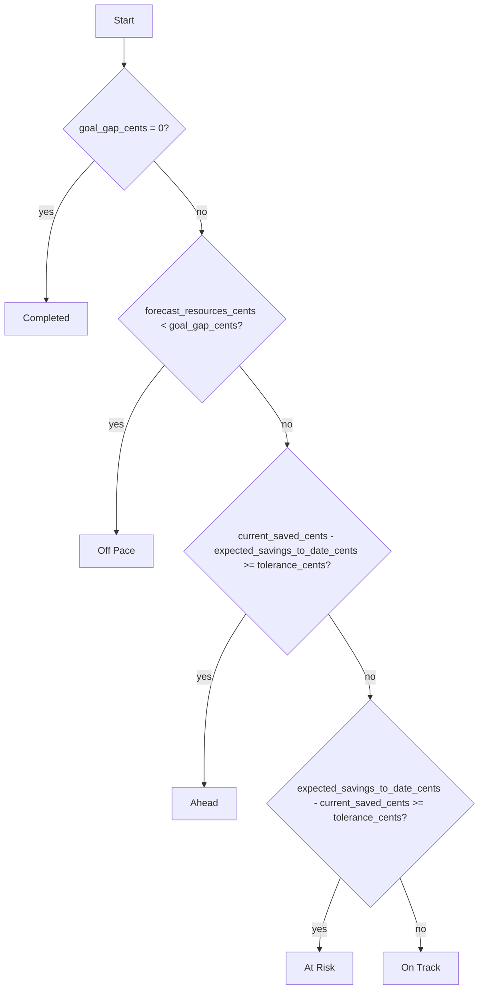

# SPEC-0003: Pace Engine Behavior

Status: Accepted
Last Updated: 2026-08-01
Related ADRs: ADR-0002, ADR-0003, ADR-0004
Related Specs: SPEC-0005
Source Requirements: SRS Section 3.3, FR-GOAL-003, FR-GOAL-005, FR-PACE-001 through FR-PACE-010

## Purpose

Define the MVP pace-engine outputs, goal lifecycle states, and calculated pace-status labels for GoalWise.

## Goal Lifecycle Status

`Goal.status` represents the lifecycle of a saved goal record.

Allowed values:

| Value | Meaning |
| --- | --- |
| `active` | The single goal currently used by the pace engine. |
| `completed` | The goal reached or exceeded its target and history is preserved. |
| `archived` | The user removed the goal from active planning without deleting its history. |

Rules:

- A user may have at most one `active` goal.
- Creating a second `active` goal is rejected while an active goal exists.
- If current saved amount becomes greater than or equal to target amount, mark the goal `completed`.
- Archived and completed goals are not returned by `GET /api/v1/goals/active`.

## Pace Status

`pace_status` is a calculated result produced by the pace engine. It is not the same as `Goal.status`.

Allowed values:

| Value | Meaning |
| --- | --- |
| `Completed` | The goal gap is zero. |
| `Off Pace` | Forecast resources are below the goal gap. |
| `Ahead` | Current goal savings exceed expected savings to date by at least the tolerance. |
| `At Risk` | Current goal savings trail expected savings to date by at least the tolerance. |
| `On Track` | None of the higher-priority statuses apply. |

## Inputs

The pace engine receives normalized inputs including:

- Formula version.
- Calculation timestamp.
- User IANA time zone.
- Goal target amount, initial saved amount, current saved amount, start date, and target date.
- Financial profile starting cash, balance-as-of date, and reserve buffer.
- Income source records.
- Planned expense records.
- Accepted transaction records when transaction support is implemented.

Input meanings:

- `starting_cash_cents` is liquid cash available outside the amount already set aside as current goal savings. The same money must not be counted in both values.
- `initial_saved_cents` is the goal-savings baseline at `start_date` and is used to compare progress over time.
- `current_saved_cents` is the amount currently set aside toward the goal and is used to calculate the remaining goal gap.

## Reserve Buffer

On first financial profile setup, the system suggests a reserve buffer equal to 5% of confirmed future income, rounded upward to the nearest whole U.S. dollar.

```text
suggested_reserve_buffer_cents =
  ceil((confirmed_future_income_cents * 0.05) / 100) * 100
```

Rules:

- If confirmed future income is zero, the suggested reserve buffer may be `$0`.
- The user must confirm or replace the suggested reserve buffer before the first valid pace calculation.
- The pace engine consumes only the confirmed `reserve_buffer_cents` value.
- After confirmation, reserve buffer is user-controlled and must not silently change when income changes.
- Future UI may show a new suggestion after income changes, but applying that suggestion requires explicit user confirmation.

## Required Outputs

The pace engine returns:

- `current_cash_cents`
- `confirmed_future_income_cents`
- `planned_future_expenses_cents`
- `reserve_buffer_cents`
- `forecast_resources_cents`
- `goal_gap_cents`
- `discretionary_capacity_cents`
- `remaining_weeks`
- `weekly_safe_to_spend_cents`
- `projected_shortfall_cents`
- `expected_savings_to_date_cents`
- `pace_status`

## Formula Rules

Use integer cents for all monetary inputs and intermediate values.

```text
current_cash =
  starting_cash
  + accepted inflows after balance-as-of date
  - accepted outflows after balance-as-of date
```

```text
forecast_resources =
  current_cash
  + confirmed_future_income
  - planned_future_expenses
  - reserve_buffer
```

```text
goal_gap = max(0, target_amount - current_saved_amount)
```

```text
discretionary_capacity = forecast_resources - goal_gap
```

```text
remaining_weeks =
  max(1, ceiling(calendar days from calculation local date to target date / 7))
```

```text
weekly_safe_to_spend =
  max(0, floor(discretionary_capacity / remaining_weeks))
  rounded down to whole U.S. dollars
```

```text
projected_shortfall = max(0, goal_gap - forecast_resources)
```

## Expected Savings to Date

Calculate expected savings to date using linear progress from the goal start date and initial saved amount to the target amount at the target date.

```text
elapsed_days = calendar days from start_date to calculation local date
total_days = calendar days from start_date to target_date
progress_ratio = clamp(elapsed_days / total_days, 0, 1)
expected_savings_to_date =
  initial_saved_amount
  + floor((target_amount - initial_saved_amount) * progress_ratio)
```

The exact day-boundary behavior belongs in SPEC-0005: Date and Time Semantics.

## Pace Status Decision Tree

Tolerance:

```text
tolerance_cents = max(2500, floor(target_amount_cents * 0.05))
```

Evaluate in this order:



## Golden Scenarios

Required golden tests:

- `Completed`: current saved amount equals or exceeds target amount.
- `Off Pace`: forecast resources are below goal gap and projected shortfall is positive.
- `Ahead`: current savings exceeds expected savings to date by at least tolerance while forecast resources cover goal gap.
- `At Risk`: current savings trails expected savings to date by at least tolerance while forecast resources cover goal gap.
- `On Track`: forecast resources cover goal gap and current savings is within tolerance of expected savings.
- `Less Than One Week`: target date fewer than seven days away uses one remaining week.
- `Rounding`: final weekly safe-to-spend rounds down to whole U.S. dollars.
- `Unconfirmed Income`: unconfirmed income remains visible in inputs but excluded from forecast resources.
- `Reserve Buffer Suggestion`: confirmed future income of zero suggests `$0`; nonzero confirmed future income suggests 5% rounded upward to the nearest whole dollar.

## Verification

Required tests:

- Pace status labels match exactly: `Completed`, `Off Pace`, `Ahead`, `At Risk`, `On Track`.
- Goal lifecycle status values match exactly: `active`, `completed`, `archived`.
- Pace status and goal lifecycle status are not stored as the same concept in snapshot results.
- First calculation is skipped until the reserve buffer is confirmed or replaced.
- Confirmed reserve buffer is subtracted from forecast resources.
- The decision tree evaluates `Completed` before `Off Pace`.
- The decision tree evaluates `Off Pace` before `Ahead` and `At Risk`.
- Golden scenarios pass to the cent for intermediate values and to the rounded whole dollar for weekly safe-to-spend.
