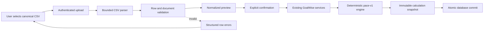

# SPEC-0010: Canonical Planning CSV Import

Status: Accepted
Last Updated: 2026-08-27
Related ADRs: ADR-0002, ADR-0003, ADR-0004, ADR-0007, ADR-0010, ADR-0011
Related Specs: SPEC-0003, SPEC-0004, SPEC-0005, SPEC-0007, SPEC-0008
Source: `.agents/implementation/phase-12-planning-csv-import.md`

## Purpose

Define the contract for importing a complete GoalWise planning setup from one
canonical CSV file.

This is a planning-input import, not a raw bank-statement or transaction
import. The file contains values that have already been translated into the
same concepts the user can enter through the GoalWise forms. A converter may
be built outside GoalWise in the future, but the converter is not part of this
specification.

The feature is a planned post-MVP increment. It does not change the current
MVP rule that manual entry is the only exposed input method until the feature
is implemented, tested, and its scope status is updated.

## Product Boundary

The import represents one user's complete setup:

- one savings goal;
- one financial profile containing starting cash, balance date, and reserve
  buffer;
- zero or more expected income sources;
- zero or more planned expenses.

It must not represent or infer:

- raw bank transactions;
- bank accounts, account numbers, or credentials;
- categories inferred from free-form descriptions;
- recurring schedules inferred from transaction history;
- multiple active goals;
- a safe-to-spend value supplied by the file;
- a pace result or snapshot supplied by the file.

The backend remains responsible for validation, ownership, normalization,
calculation, and snapshot creation.

## Canonical File Format

### Encoding and structure

- The file must be UTF-8 encoded.
- The file must contain one header row followed by zero or more data rows.
- The delimiter is a comma.
- Quoted fields and embedded commas must follow RFC 4180-compatible CSV rules.
- Header names are case-sensitive and must exactly match the header below.
- Header columns may appear in any order, but every declared column must be
  present exactly once.
- Empty lines after the header are ignored.
- Whitespace inside a quoted value is meaningful. Unquoted surrounding
  whitespace is trimmed before validation.
- Unknown columns are rejected. This prevents a converter from silently
  emitting data that GoalWise does not understand.
- A file with no data rows is invalid.

### Header

```csv
record_type,name,target_amount,initial_saved,current_saved,starting_cash,balance_date,reserve_buffer,amount,date,frequency,confidence,classification,start_date,target_date
```

### Record types

| `record_type` | Domain entity | Cardinality | Purpose |
| --- | --- | --- | --- |
| `goal` | `Goal` | Exactly one | Defines the savings target and baseline/current saved values. |
| `cash` | `FinancialProfile` | Exactly one | Defines the current cash position and protected reserve. |
| `income` | `IncomeSource` | Zero or more | Defines expected future money coming in. |
| `expense` | `PlannedExpense` | Zero or more | Defines known future costs to hold aside. |

The value is case-sensitive. Every row must have exactly one supported
`record_type`.

### Example

```csv
record_type,name,target_amount,initial_saved,current_saved,starting_cash,balance_date,reserve_buffer,amount,date,frequency,confidence,classification,start_date,target_date
goal,Moving fund,3000.00,500.00,1125.00,,,,,,,,,2026-08-01,2026-11-15
cash,,,,,2000.00,2026-08-26,300.00,,,,,,,
income,Salary,,,,,,,2500.00,2026-09-01,biweekly,confirmed,,,
expense,Rent,,,,,,,1400.00,2026-09-01,monthly,,essential,,
```

The example is illustrative. It is valid only when the values also satisfy
the existing goal, financial-input, date, and recurrence rules.

### Import flow



## Field Contract

Blank means “not applicable” for a field that is not used by the row type. A
blank in a required field is invalid. Values are not inferred from another
field and defaults are not silently applied, except where an existing domain
validator explicitly defines a safe default.

| Field | Applies to | Required | Meaning and validation |
| --- | --- | --- | --- |
| `record_type` | All rows | Yes | One of `goal`, `cash`, `income`, `expense`. |
| `name` | `goal`, `income`, `expense` | Yes | Existing domain length and nonblank rules apply. `cash` must be blank. |
| `target_amount` | `goal` | Yes | Nonnegative decimal USD amount. Stored as integer cents. |
| `initial_saved` | `goal` | Yes | Nonnegative decimal USD baseline saved amount. Stored as integer cents. |
| `current_saved` | `goal` | Yes | Nonnegative decimal USD current saved amount. Stored as integer cents. |
| `starting_cash` | `cash` | Yes | Nonnegative decimal USD cash available at the balance date. Stored as integer cents. |
| `balance_date` | `cash` | Yes | Local calendar date in `YYYY-MM-DD`. |
| `reserve_buffer` | `cash` | Yes | Nonnegative decimal USD amount. Stored as integer cents. |
| `amount` | `income`, `expense` | Yes | Nonnegative decimal USD amount. Stored as integer cents. |
| `date` | `income`, `expense` | Yes | Next occurrence date as a local calendar date in `YYYY-MM-DD`. |
| `frequency` | `income`, `expense` | Yes | Existing supported recurrence value for the corresponding domain model. |
| `confidence` | `income` | Yes | Existing supported income confidence value. |
| `classification` | `expense` | Yes | Existing supported planned-expense classification value. |
| `start_date` | `goal` | Yes | Local calendar date in `YYYY-MM-DD`. |
| `target_date` | `goal` | Yes | Local calendar date later than `start_date`. |

All fields not listed as applicable to a row must be blank. Rejecting
extraneous populated fields makes malformed converter output visible instead
of silently discarding it.

## Money Normalization

- Input amounts are decimal dollar strings for human and converter usability.
- A leading `$` is not accepted; the file format is numeric, not formatted
  display text.
- Amounts must be nonnegative and contain at most two decimal places.
- A whole number such as `3000` is valid and means `3000.00` dollars.
- A value such as `3000.999` is invalid rather than rounded.
- Negative values, exponent notation, `NaN`, `Infinity`, and locale-specific
  separators are invalid.
- Parsing must use decimal arithmetic and then convert exactly to integer cents.
- The importer must never use binary floating-point arithmetic for money.
- Imported money must pass the same domain limits as equivalent manual input.

## Date and Recurrence Semantics

- Dates are date-only values with the user's local calendar semantics, as
  defined in SPEC-0005.
- A date must be a real Gregorian date in `YYYY-MM-DD` format.
- The importer must not reinterpret a date through the browser's UTC date
  conversion.
- Goal date rules, recurrence rules, and forecast-window rules are reused from
  the existing domain behavior.
- The CSV does not include a time zone. The authenticated user's configured
  time zone supplies the context for date-only validation.
- The CSV does not include generated occurrence rows. Recurrence expansion is
  performed by the existing planning/calculation services.

## Cross-Row Rules

The complete document is valid only when:

1. exactly one `goal` row exists;
2. exactly one `cash` row exists;
3. every `income` and `expense` row is individually valid;
4. no unsupported record type occurs;
5. no row has a populated field that does not apply to its record type;
6. no duplicate singleton row exists;
7. all rows satisfy existing domain limits and date rules;
8. the document stays within the configured row and byte limits.

The importer must not calculate or accept a result from the CSV itself. Once a
document is valid and confirmed, the existing service boundary loads the
normalized planning inputs and runs the deterministic `pace-v1` engine.

## Limits and Upload Handling

The implementation must define constants for bounded upload handling. The
initial limits are:

- maximum file size: 1 MiB;
- maximum data rows: 500;
- maximum field length: 500 characters;
- maximum number of income rows: 100;
- maximum number of expense rows: 100.

The parser must reject a file that exceeds a limit before it becomes a
persistable import object. Limits may be tightened or increased through a
spec update; the importer must not make them unbounded by default.

## Validation Errors

Validation returns structured, user-correctable errors. Each error includes:

- `row`: one-based CSV row number, including the header as row 1;
- `field`: the relevant header name, or `document` for a cross-row error;
- `code`: stable machine-readable error code;
- `message`: plain-language corrective guidance.

The response may include multiple errors, but it must be bounded by a defined
maximum error count. When that maximum is reached, the response includes a
summary error indicating that additional errors were omitted.

Errors must not echo the complete uploaded file. They must not expose session
tokens, credentials, server paths, SQL, stack traces, or another user's data.

Minimum error cases:

- missing, duplicated, or unknown header;
- invalid UTF-8;
- malformed CSV quoting;
- missing required field;
- populated inapplicable field;
- invalid record type;
- invalid decimal amount;
- negative amount;
- invalid date;
- unsupported frequency, confidence, or classification;
- duplicate `goal` or `cash` row;
- missing `goal` or `cash` row;
- row or file limit exceeded;
- domain validation failure.

## Preview Contract

Preview is required before persistence. A preview request:

- requires an authenticated user and the existing CSRF protection for the
  state-changing multipart request;
- parses and validates the upload without changing planning data;
- returns row counts, document validity, structured errors, and normalized
  values needed for user review;
- does not return or persist a pace result supplied by the file;
- does not create a calculation snapshot;
- does not mutate the current goal, financial profile, income sources, or
  planned expenses;
- is scoped to the authenticated user;
- expires or is otherwise bound to the initiating session before confirmation.

The preview must distinguish between:

- a valid document that can be confirmed;
- an invalid document that requires correction;
- an upload that was rejected before parsing because it exceeded a limit.

The exact route names and response envelope must follow the versioned API
conventions in SPEC-0002. The preview API must not expose a raw file download
or arbitrary uploaded content.

## Confirmation and Persistence Contract

Confirmation is explicit and must refer to a valid preview. The initial
implementation uses complete-plan replacement as specified by ADR-0011:

- confirmation is authenticated and CSRF-protected;
- the backend revalidates the preview or its signed server-side representation
  before writing;
- the existing setup is replaced only after all imported values pass domain
  validation;
- when an active goal exists, its editable goal and financial-profile values
  are updated in place rather than creating and archiving a second goal;
- stale income and expense rows from the previous setup are not left active;
- prior goal and financial-input values are not retained as a separate editable
  plan, but prior immutable calculation snapshots remain available as history;
- the write and resulting calculation snapshot commit atomically;
- a failure leaves the prior committed setup and latest snapshot unchanged;
- the calculation is run by the existing deterministic service path;
- snapshots remain immutable and contain normalized facts, not raw CSV content.

The import must not accept a client-provided user ID, ownership value,
snapshot ID, formula version, pace status, safe-to-spend amount, or result
JSON as authoritative input.

## Security and Privacy

- Treat uploaded CSV content as untrusted input.
- Use a real CSV parser, not string splitting or ad hoc regular expressions.
- Do not log uploaded rows, raw file contents, exact financial values, or
  personal descriptions.
- Do not store the original uploaded file by default.
- Do not accept bank credentials, account numbers, payment-card data, or
  other credentials through this format.
- Enforce the authenticated user's ownership at the service/repository
  boundary for every persisted record.
- Apply upload size, row-count, field-length, request-rate, and timeout
  controls appropriate to the hosted environment.
- An import from one user must not alter or reveal another user's data.
- The importer must not call an AI provider or external converter at runtime.

## Verification Requirements

### Parser and contract tests

- valid complete document;
- valid document with no income or expense rows;
- quoted names containing commas;
- UTF-8 names;
- reordered supported headers;
- blank lines after the header;
- malformed quoting;
- invalid encoding;
- unknown or duplicate headers;
- unsupported record types;
- inapplicable populated fields;
- missing required values;
- invalid money and date forms;
- duplicate or missing singleton rows;
- row, field, and file-size limits;
- stable row and field error locations.

### Service and persistence tests

- preview creates no database write side effects;
- confirmed import creates the expected user-owned records;
- imported values match equivalent manual input after normalization;
- confirmed import recalculates through `pace-v1`;
- replacement removes stale active income and expense rows;
- failed replacement rolls back all imported changes;
- snapshots remain immutable;
- a client cannot assign imported records to another user;
- cross-user preview or confirmation access follows the existing private
  resource contract.

### End-to-end tests

Playwright covers the user-visible flow:

1. sign in;
2. select a valid canonical CSV;
3. review the preview;
4. confirm the replacement;
5. verify the goal, cash, income, expense, and dashboard views;
6. upload an invalid file and correct it without a misleading success state;
7. verify that a failed confirmation preserves the prior setup.

CI tests use an isolated database and never staging or production data.

## Out of Scope

- raw transaction import;
- bank-statement parsing;
- PDF, OFX, QFX, or bank-specific formats;
- external converter implementation;
- runtime AI classification or inference;
- merge mode for existing rows;
- multiple active goals;
- changes to `pace-v1` formulas;
- export, account deletion, or background scheduling.
